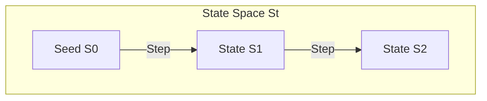
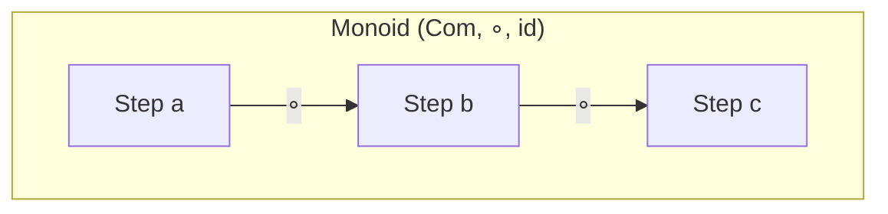
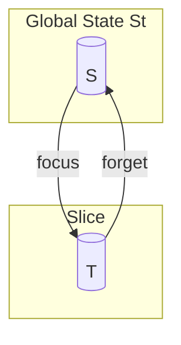
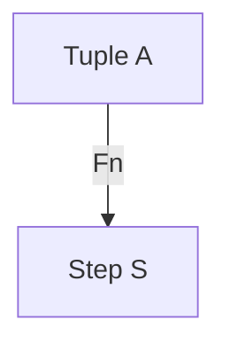
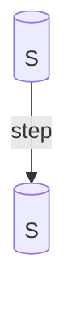
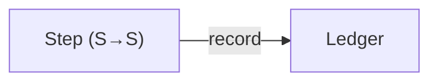
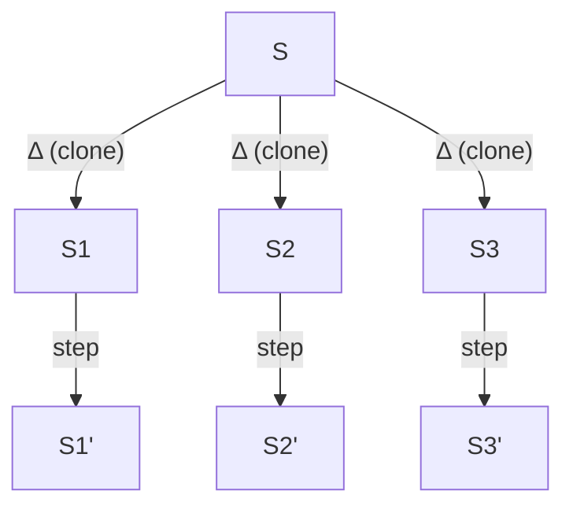
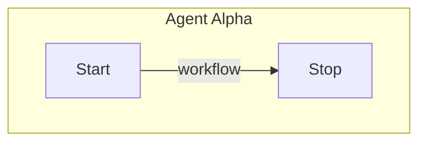

# Agent Fx Proof System

## A Category-Theoretic View of `agentfx.ts`

Below is a **target documentation skeleton** that re-expresses the public API and hidden mechanics of **Agent Fx (v1.3)** as a rigorous proof system, mirroring the style of your restaurant-operations example. Each numbered section defines a *category*, *monoid*, *functor*, or *adjunction* and supplies a Mermaid diagram you can drop into Markdown.

---

## 1 State Category `𝑺𝒕`

Every immutable program state is an **object**; every pure function
`f : S → S` (including `Step<S>`) is a **morphism**.



*Associativity & identity* are inherited from JS function composition, so `𝑺𝒕` is a **category**.

---

## 2 Event Category `𝑬𝒗𝒕`

Objects are **ledger snapshots**; morphisms are **events**
`e : (Ledger) → (Ledger + 1)` that append themselves.
`𝑬𝒗𝒕` comes with a **forgetful functor** `U : 𝑬𝒗𝒕 → 𝑺𝒕` mapping each ledger to its before-state hash.

---

## 3 Composition Monoid `𝑪𝒐𝒎` (Sequence ▸ Parallel ▸ Loop)



* **Binary op** `∘` = `sequence`
* **Identity** = `Fx.action('id', ()=>x=>x)`
* `parallel` is a *commutative* monoid on clones of `S`
* `loopWhile` gives the **free monoid** on `⟨predicate, body⟩`.

---

## 4 Lens Adjunction `focus ⊣ forget`



`focus(path, step)` is the **left adjoint** (free functor) that embeds a slice into global state;
the implicit “forget” functor simply projects `S ↠ T`.
*η (unit)* = embed; *ε (counit)* = project.

---

## 5 Tool Registry Category `𝑻𝒐𝒐𝒍`

Objects: **typed call sites** `name : schema`
Morphisms: **factory functors** `Fₙ : Args → Step<S>`



`registerTool` yields **natural transformations**

```
ηₙ : schema ⇒ (Args ↦ Step)
```

because JSON-schema validation commutes with argument passing.

---

## 6 Resilience Functor `R : 𝑺𝒕 → 𝑺𝒕`

`wrap(name, step)` decorates any morphism with

* **rate-limit comonad** `Token`
* **retry monad** `Retry`
* **ttl cache** `Cache`



`R` is **idempotent** (`R∘R = R`) and a **functor** because it preserves composition and identity.

---

## 7 Logging Natural Transformation `record : Step ⇒ Ledger`



For every step `σ`, `record(σ)` inserts an *event* before yielding.
Commutativity guarantees **referential transparency**: identical inputs ↦ identical hashes.

---

## 8 Concurrency Comonoid `(C, Δ, ε)`

`concurrency(step, k)` copies state into up to **k** parallel branches.



`Δ` = structuredClone; `ε` = identity.

---

## 9 Prompt Functor `P : 𝑺𝒕 → 𝑺𝒕×Txt`

Maps a state to `(state, llm(prompt(state)))`.
`extract` is then an **endofunctor** reducing text back into `𝑺𝒕` via schema-validated setters.

---

## 10 Agent Lifecycle 2-Cell



`agent(name, wf)` forms a **2-morphism** in the bicategory of state transitions, bracketing a workflow with *start*/*stop* events.

---

## 11 Spawn Monad `Spawn(S) = IO S`

`spawn(workflow, seed)` lifts pure category-inside effects into the **IO monad**—executing outside the main ledger while still respecting the same laws.

---

## 12 Universal Property (Determinism ⊣ Stochasticity)

A step is **deterministic** (`tool`, `action`) *iff* its morphism factors through `Cache ⊣ LLM` counit.
Hence every stochastic `prompt` has a unique deterministic *reduction* once `rep` is fixed—analogous to your *Stock ⊣ Demand* adjunction.

---

**Agent Fx Proof-System Summary**

| Concept         | Categorical construct       | API surface                  |
| --------------- | --------------------------- | ---------------------------- |
| Immutable state | Objects in `𝑺𝒕`           | `S` generics                 |
| Steps           | Morphisms `S→S`             | `Step<S>`                    |
| Ledger          | Free monoid on events       | `record`, `Event`            |
| Composition     | Monoid `sequence/parallel`  | `Fx.sequence`, `Fx.parallel` |
| Lenses          | Adjunction `focus ⊣ forget` | `Fx.focus`, `Fx.set`         |
| Tools           | Functor from typed args     | `registerTool`, `callTool`   |
| Resilience      | Idempotent functor `R`      | `wrap`, `retry`, `throttle`  |
| Concurrency     | Comonoid structure          | `Fx.concurrency`             |
| Prompt/LLM      | Endofunctor with `P`        | `Fx.prompt`, `extract`       |
| Agents          | 2-morphisms in a bicat      | `Fx.agent`, `spawn`          |

This layout mirrors your restaurant proof system and is ready to be expanded with full proofs, law checks, or property-based tests. Drop the Mermaid snippets into your docs and iterate!
