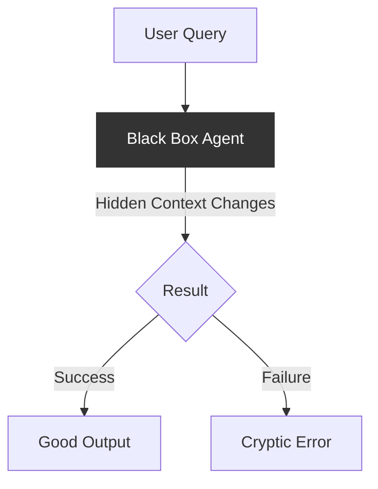
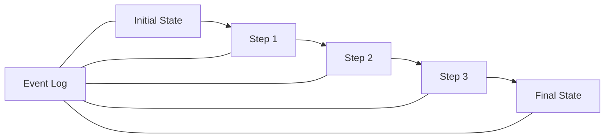
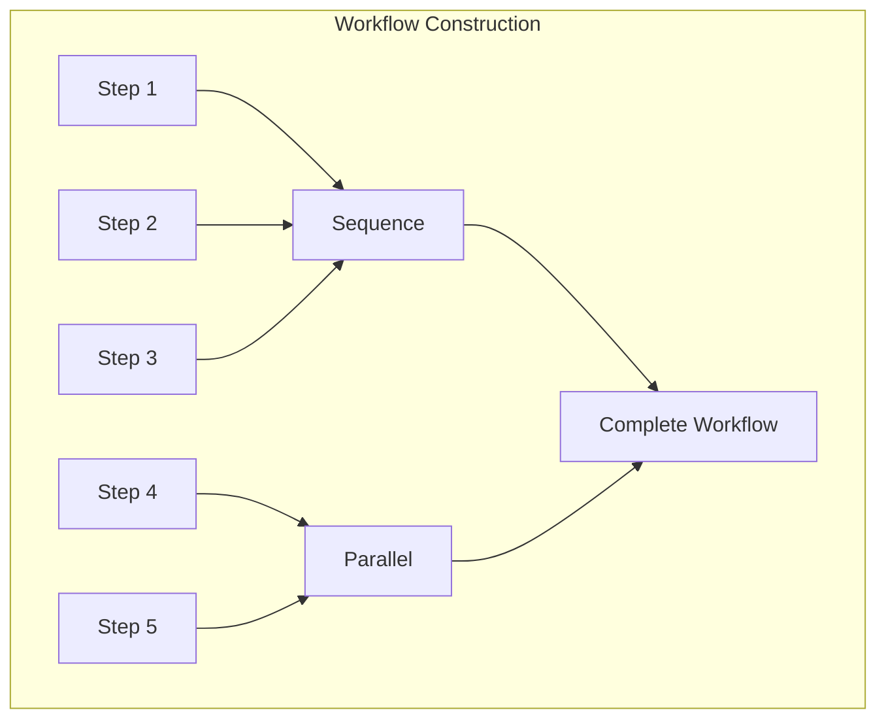
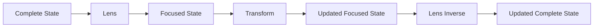
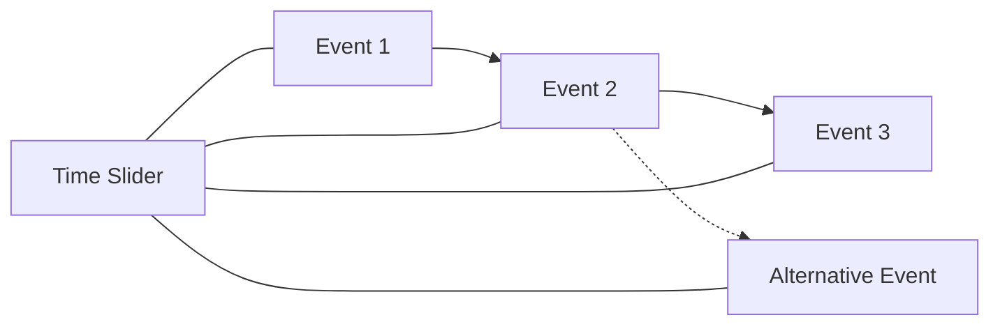
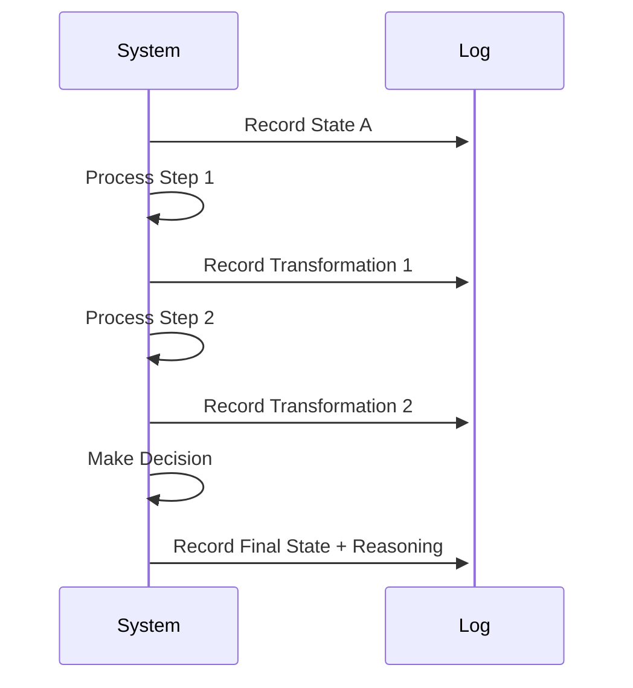
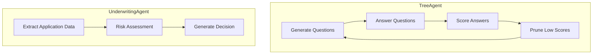
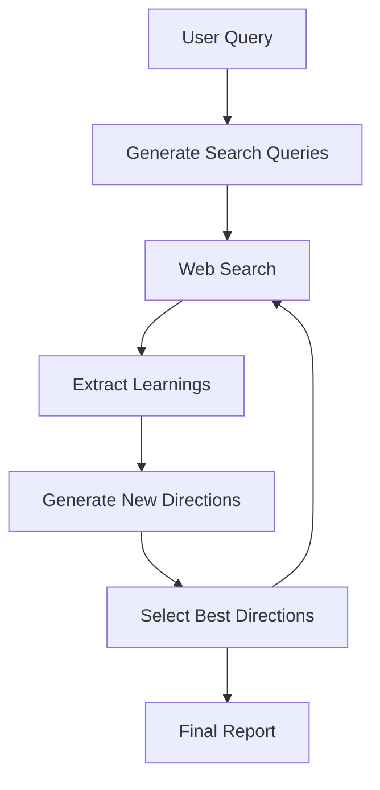
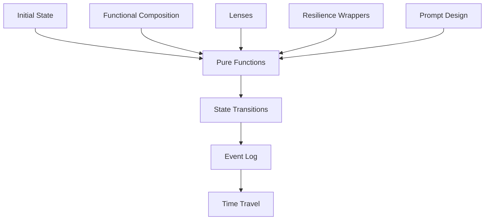
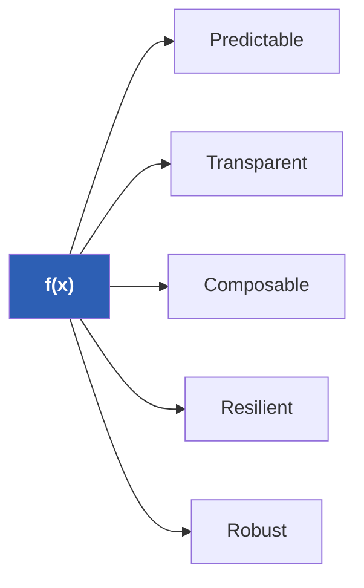

# Introducing f(x): A Functional Approach to AI Agent Workflows

**How to build complex agent workflows that are reliable, transparent, and easy to reason about?** 

**f(x)**, a TypeScript framework that brings functional programming principles to AI agent development. At its core, f(x) is about turning chaotic agent logic into clear, predictable flows where each step is a pure transformation of state.

All of f(x)'s capabilities—durable execution, time travel debugging, and robust error handling—emerge from its functional design, implemented in just ~650 lines of TypeScript. 

**✨ The framework is completely agnostic to underlying tools and models—it wraps any LLM, RAG setup, or existing libraries without imposing opinions about implementation. ✨**

## The Problem with Traditional Agent Frameworks

AI agents are fundamentally context-centric—they consume, transform, and produce context at every step. Yet traditional agent frameworks often fail to treat context as a first-class concern, leading to several critical problems:

❌ **Hidden State**: Changes happen behind the scenes with no record of transformations  
❌ **Context Fragmentation**: Context gets scattered across different components with no coherent model  
❌ **Unpredictable Execution**: Side effects make debugging difficult and lead to inconsistent behaviors  
❌ **Manual Context Management**: Developers must manually track and pass context between operations  
❌ **Rigid Workflows**: Hard to compose and adapt dynamically as requirements evolve  
❌ **Execution Fragility**: Long-running agents are vulnerable to failures with no clean recovery paths  



What agents need is a framework that treats their entire lifecycle as a single coherent abstraction—where context flows predictably through pure transformations that are traceable and recoverable.

## f(x): A Different Approach

The f(x) framework flips this model by treating each agent step as a mathematical function that transforms state in a predictable way:



Every state transition is a pure function: `(state) => newState`. These functions compose together to form workflows, with each step recorded in a complete event log.

This simple yet powerful abstraction unlocks capabilities that are challenging to implement in traditional frameworks:

✅ **Durable Execution**: Workflows can be paused, resumed, or recovered from any point  
✅ **Agent Lifecycle Control**: Start, stop, and pause agents with clean state boundaries  
✅ **Fire-and-Forget Operations**: Spawn agents that run independently with built-in resilience  
✅ **Transparent Debugging**: Every state change is captured and can be inspected  
✅ **Flexible Composition**: Mix and match operations without worrying about side effects  

**✨ Transparent by design: The way you compose functions in code directly maps to execution flow. Your code naturally diagrams how data transforms through each step of your agent. ✨**

All of this emerges naturally from the consistent application of functional programming principles—no special cases, just pure functions transforming immutable state.

## Key Features of f(x)

### 1. Pure Functional Transforms

Every operation in f(x) is a pure function that transforms state without side effects:

```typescript
// A simple step that adds data to the state
const addData = Fx.action("addData", (data) => (state) => ({
  ...state,
  data: [...state.data, data]
}));
```

### 2. Composition

Complex workflows emerge from simple building blocks:



```typescript
// Combining steps into a workflow
const workflow = Fx.sequence(
  step1,
  step2,
  Fx.parallel(step3, step4),
  step5
);
```

### 3. Focus with Lenses

Lenses let you zoom in on just the part of state you care about:



```typescript
// Just update the 'user.preferences' part of state
const updatePreferences = Fx.focus(
  ['user', 'preferences'],
  Fx.action("updateTheme", (theme) => (prefs) => ({
    ...prefs,
    theme
  }))
);
```

### 4. Robust LLM Response Handling

f(x) includes sophisticated JSON handling to deal with the challenges of parsing LLM outputs:

```typescript
// Extract structured data from LLM responses with intelligent parsing
const extractInsights = Fx.extract({
  name: "extractInsights",
  prompt: (state) => `Analyze these results: ${state.data}`,
  schema: InsightSchema,
  fallback: [],
  path: ['insights']
})(state, log);
```

## What Makes f(x) Special

Beyond the functional approach, f(x) offers several powerful capabilities that emerge naturally from its design:

### 1. Time Travel Debugging

Because every state change is captured in the event log, you can:
- 🔍 Reconstruct any historical state
- 🔍 See exactly how you got to the current state
- 🔍 Compare different execution paths



The framework's built-in debugging hooks provide unprecedented visibility:

```typescript
// Attach a debug hook to inspect events and state transitions
Fx.debug((event, newState) => {
  // Log events to console
  console.log(`Event: ${event.name} at ${event.ts}`);
  
  // Capture state snapshots at specific points
  if (event.name === 'criticalOperation') {
    saveSnapshot(newState);
  }
  
  // Trace specific data paths through transformations
  tracePath(newState, 'results.insights');
});
```

The event log includes:
- 📊 Unique event IDs for correlation
- 📊 Timestamps for timing analysis
- 📊 Before/after state hashes to detect changes
- 📊 Complete argument capture for reproducibility
- 📊 Metadata about operations and errors

### 2. Transparent Decision Making

The event log creates a complete record of how decisions were made:



Every decision has full provenance - nothing happens without being recorded.

### 3. Resilience Built In

The framework handles retries, caching, and rate limiting without cluttering your business logic:

```typescript
// Automatically get retries, caching, and rate limiting with wrap
const robustStep = Fx.wrap("importantOperation", innerStep);

// Explicit retry with configurable parameters
const retryableStep = Fx.retry(complexOperation, {
  attempts: 5,     // Number of attempts before giving up
  delay: 300,      // Initial delay in ms
  backoff: 2       // Exponential backoff multiplier
});

// Rate limiting to respect API constraints
const throttledStep = Fx.throttle(apiCall, 5); // 5 queries per second
```

These resilience patterns are implemented as pure functional decorators, preserving immutability while providing:
- 🛡️ Automatic retries with exponential backoff for transient failures
- 🛡️ Rate limiting for API-intensive operations
- 🛡️ Request caching to avoid duplicate calls
- 🛡️ Clean error propagation with contextual details

### 4. Composable Workflows

Build complex behaviors from simple pieces:



### 5. Effective Prompt Design

f(x) treats prompt design like web design - as a structured communication interface:

```typescript
// Clear, explicit prompt structure for reliable LLM responses
const buildLearningPrompt = (state) => `
  Analyze these search results about "${state.topic}":
  
  ${formatSearchResults(state)}
  
  IMPORTANT: Return your response as pure JSON without markdown formatting:
  [
    {"insight": "...", "source": "...", "confidence": 8},
    ...
  ]
`;
```

Key principles in our prompt design:
- 📝 Clear format expectations
- 📝 Explicit examples of correct output
- 📝 Consistent structure across prompts
- 📝 Format validation with fallbacks

## Real-World Example: RecursiveResearchAgent

Let's see f(x) in action with the RecursiveResearchAgent, which performs multi-step research on any topic:



The implementation maintains functional purity throughout:

```typescript
// One research iteration using function composition
const researchIteration = Fx.wrap(
  "researchIteration", 
  async (state, log) => {
    // Execute research steps in sequence with proper error handling
    const afterSearchState = await searchWeb(state, log);
    const afterLearningsState = await extractLearnings(afterSearchState, log);
    const afterDirectionsState = await generateNextDirections(afterLearningsState, log);
    return await selectNextQueries(afterDirectionsState, log);
  }
);

const recursiveResearchAgent = Fx.agent(
  "RecursiveResearchAgent",
  Fx.wrap("researchWorkflow", async (state, log) => {
    // Initial query generation if needed
    const initializedState = await generateInitialQueriesIfNeeded(state, log);
    
    // Execute research iterations until complete
    const researchedState = await Fx.loopWhile(
      s => !s.isComplete,
      researchIteration
    )(initializedState, log);
    
    // Generate final report
    return await generateReport(researchedState, log);
  })
);
```

## How It All Works Together

The magic of f(x) is in how these concepts combine:



## Benefits for AI Agent Development

This approach offers compelling benefits when building AI agents:

1. **Predictability**: Know exactly how your agent will behave
2. **Auditability**: Trace every decision back to its origins
3. **Adaptability**: Easily modify workflows by composing functions differently
4. **Resilience**: Handle failures gracefully with built-in retry and recovery
5. **Visibility**: See inside the "black box" of your agent's reasoning
6. **Reliability**: Robust parsing of LLM responses with smart fallbacks

## Getting Started

Using f(x) is straightforward:

```typescript
// Define your state type
interface MyState {
  query: string;
  results: string[];
}

// Create some steps
const processQuery = Fx.action("process", () => 
  (state: MyState) => /* transform state */);

const generateResults = Fx.prompt("generate", 
  (state) => `Generate results for: ${state.query}`,
  llm);

// Compose a workflow
const workflow = Fx.sequence(processQuery, generateResults);

// Run it
const initialState = { query: "How to make pasta?", results: [] };
Fx.spawn(workflow, initialState)
  .then(finalState => console.log(finalState.results));
```

## Conclusion

f(x) brings the clarity and reliability of functional programming to the often chaotic world of AI agents. By modeling agent workflows as composable, pure functions with comprehensive logging, we gain unprecedented visibility, reliability, and flexibility.


The framework is available now on GitHub. Give it a try and transform how you build AI agents!



---

Ready to get started? Check out the [GitHub repository](https://github.com/skishore23/fx) for documentation, examples, and to start building your first functional agent! 