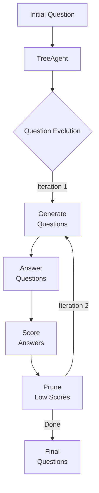

# Tree Agent

A question-refinement system that evolves questions through iterations, scoring, and pruning to arrive at high-quality options.

## Architecture



## State Representation

The state is represented as immutable tree structures:

```typescript
interface Node {
  id: string;
  prompt: string;
  answer?: string;
  score?: number;
  children: string[];
}

interface Tree {
  rootId: string;
  nodes: Record<string, Node>;
  iteration: number;
}
```

## Implementation

The TreeAgent operates through these steps:

1. **Initialization**: Creates a tree with a root question node
2. **Iteration**: For each iteration (default: 3)
   - **Branching**: Generates three distinct follow-up questions
   - **Answering**: Obtains concise answers for each question
   - **Scoring**: Rates answers from 0-10 for usefulness
   - **Pruning**: Removes questions with scores below 5
3. **Results**: Returns refined, high-quality questions with answers

## Usage Example

```typescript
// Create a seed state
const seed = {
  iteration: 0,
  rootId: "root",
  nodes: {
    root: { 
      id: "root", 
      prompt: "How to reduce insurance fraud with AI?", 
      children: [] 
    }
  }
};

// Run the agent
Fx.spawn(treeAgent, seed)
  .then(result => {
    console.log("Final questions:", result.nodes[result.rootId].children.map(id => 
      result.nodes[id].prompt
    ));
  });
```

## Visualization

The agent's execution can be visualized in real-time, showing:
- Question tree evolution
- Scoring and pruning decisions
- State transitions
- Event timeline

For visualization details, see the [Visualization Guide](../advanced/visualization.md). 