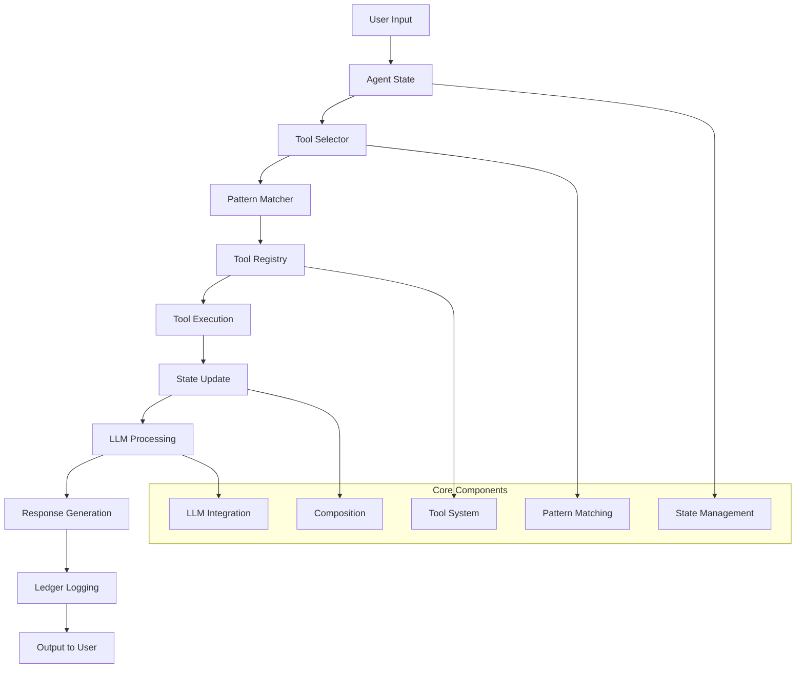
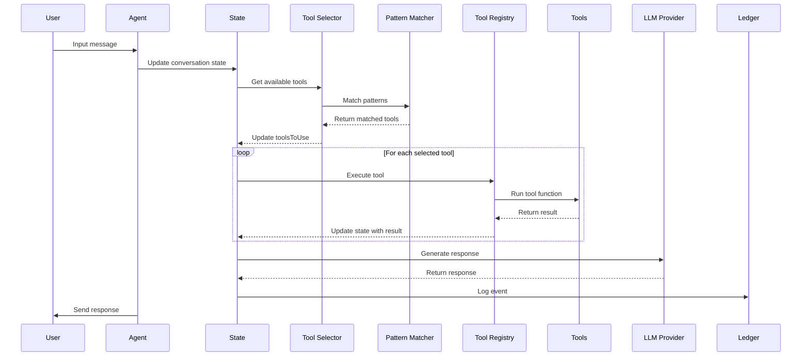
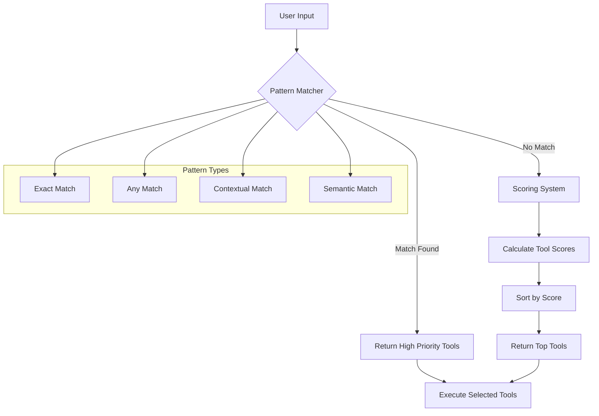
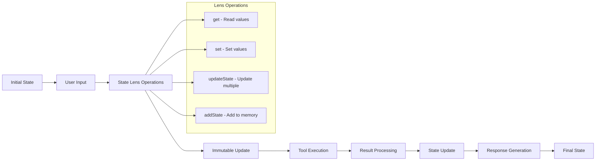

# Creating an Agent with Fx Framework

This guide walks you through creating a complete agent using the Fx Framework, from basic setup to patterns and tool integration.

## Table of Contents

1. [Overview](#overview)
2. [Agent Architecture](#agent-architecture)
3. [Step 1: Define Your Agent State](#step-1-define-your-agent-state)
4. [Step 2: Create Tool Schemas](#step-2-create-tool-schemas)
5. [Step 3: Implement Tools](#step-3-implement-tools)
6. [Step 4: Create Tool Selector](#step-4-create-tool-selector)
7. [Step 5: Define Prompts](#step-5-define-prompts)
8. [Step 6: Build Workflow](#step-6-build-workflow)
9. [Step 7: Create Agent](#step-7-create-agent)
10. [Patterns](#patterns)
11. [Best Practices](#best-practices)

## Overview

The Fx Framework provides a functional, category theory-based approach to building AI agents. Every agent follows these core principles:

- **Functional Composition**: Agents are built by composing pure functions
- **State Management**: Immutable state transformations using lenses
- **Pattern Matching**: Tool selection based on user input
- **Error Handling**: Functional error handling with `Either` monad
- **Ledger System**: Built-in audit trail and durability

## Agent Architecture



### Detailed Agent Flow



### Tool Selection Process



### State Management Flow



## Step 1: Define Your Agent State

Start by defining your agent's state interface, extending `BaseContext`:

```typescript
import { BaseContext } from '@fx/core';

interface MyAgentState extends BaseContext {
  // Core conversation
  conversation: Array<{ role: string; content: string }>;
  
  // Agent-specific state
  currentGoal: string;
  plan: string[];
  currentStep: number;
  maxIterations: number;
  iterationCount: number;
  
  // Tool results
  lastToolResult?: unknown;
  lastError?: string;
  
  // Domain-specific state
  // Add your specific fields here
  userPreferences?: Record<string, any>;
  sessionData?: Record<string, any>;
  
  // Memory (fx-core ledger)
  memory: Array<{
    type: 'action' | 'observation' | 'error';
    content: string;
    timestamp: string;
    metadata?: Record<string, any>;
  }>;
}
```

### State Management Principles

- **Immutable**: State is never mutated directly
- **Lens-based**: Use `get`, `set`, `updateState`, `addState` for transformations
- **Composable**: State changes are pure functions that can be composed

## Step 2: Create Tool Schemas

Define Zod schemas for your tools to ensure type safety:

```typescript
import { z } from 'zod';

// Example: File operations
const ReadFileSchema = z.object({
  filePath: z.string()
});

const WriteFileSchema = z.object({
  filePath: z.string(),
  content: z.string(),
  operation: z.enum(['create', 'update', 'append'])
});

// Example: API operations
const ApiCallSchema = z.object({
  endpoint: z.string().url(),
  method: z.enum(['GET', 'POST', 'PUT', 'DELETE']),
  headers: z.record(z.string()).optional(),
  body: z.any().optional()
});

// Example: Search operations
const SearchSchema = z.object({
  query: z.string(),
  maxResults: z.number().min(1).max(100).optional(),
  filters: z.record(z.string()).optional()
});
```

## Step 3: Implement Tools

Create your tools using the `createValidatedTool` function:

```typescript
import { createValidatedTool, Either, step, sequence, updateState, addState } from '@fx/core';

const createToolRegistry = (llmProvider: any) => {
  return createFxToolRegistry([
    // File reading tool
    createValidatedTool('read_file', 'Read contents of a file', ReadFileSchema,
      async (input: { filePath: string }, state: MyAgentState) => {
        const toolStep = step('read_file', async (state: MyAgentState) => {
          try {
            const content = await safeReadFile(input.filePath);
            return sequence([
              step('updateResult', (s) => updateState({
                filePath: input.filePath,
                content: content,
                wordCount: content.split(' ').length
              })(s)),
              step('logAction', (s) => addState('action', 'File read successfully')(s))
            ])(state);
          } catch (error) {
            return sequence([
              step('updateError', (s) => updateState({ error: (error as Error).message })(s)),
              step('logError', (s) => addState('observation', `Error reading file: ${(error as Error).message}`)(s))
            ])(state);
          }
        });
        return await toolStep(state) as MyAgentState;
      }
    ),

    // API call tool
    createValidatedTool('api_call', 'Make an API call', ApiCallSchema,
      async (input: { endpoint: string; method: string; headers?: Record<string, string>; body?: any }, state: MyAgentState) => {
        const toolStep = step('api_call', async (state: MyAgentState) => {
          try {
            const response = await fetch(input.endpoint, {
              method: input.method,
              headers: input.headers,
              body: input.body ? JSON.stringify(input.body) : undefined
            });
            const data = await response.json();
            return sequence([
              step('updateResult', (s) => updateState({
                endpoint: input.endpoint,
                response: data,
                timestamp: new Date().toISOString()
              })(s)),
              step('logAction', (s) => addState('action', 'API call completed successfully')(s))
            ])(state);
          } catch (error) {
            return sequence([
              step('updateError', (s) => updateState({ error: (error as Error).message })(s)),
              step('logError', (s) => addState('observation', `Error making API call: ${(error as Error).message}`)(s))
            ])(state);
          }
        });
        return await toolStep(state) as MyAgentState;
      }
    ),

    // Search tool
    createValidatedTool('search', 'Search for information', SearchSchema,
      async (input: { query: string; maxResults?: number; filters?: Record<string, string> }, state: MyAgentState) => {
        const toolStep = step('search', async (state: MyAgentState) => {
          try {
            // Use LLM to generate search results
            const searchPrompt = `Search for: ${input.query}
            Max results: ${input.maxResults || 5}
            Filters: ${JSON.stringify(input.filters || {})}
            
            Return a JSON array of search results.`;
            
            const result = await llmTemplateStep(llmProvider, promptTemplate('system', searchPrompt, []))({
              ...state,
              query: input.query
            });
            
            const results = JSON.parse((result as any).systemResponse || '[]');
            return sequence([
              step('updateResult', (s) => updateState({
                query: input.query,
                results: results,
                resultCount: results.length
              })(s)),
              step('logAction', (s) => addState('action', 'Search completed successfully')(s))
            ])(state);
          } catch (error) {
            return sequence([
              step('updateError', (s) => updateState({ error: (error as Error).message })(s)),
              step('logError', (s) => addState('observation', `Error during search: ${(error as Error).message}`)(s))
            ])(state);
          }
        });
        return await toolStep(state) as MyAgentState;
      }
    )
  ]);
};
```

### Tool Implementation Best Practices

1. **Use `createToolStep`**: Provides consistent error handling and state management
2. **Wrap in `Either`**: Use `Either.right()` for success, `Either.left()` for errors
3. **Validate inputs**: Zod schemas ensure type safety
4. **Return meaningful data**: Include metadata about the operation
5. **Handle errors gracefully**: Don't let tool failures crash the agent

## Step 4: Create Tool Selector

The tool selector determines which tools to use based on user input. It combines pattern matching with scoring:

```typescript
import { createPatternMatcher, createPattern, patterns } from '@fx/core';

// Tool scoring function
const calculateToolScore = (state: MyAgentState, tool: string): number => {
  const lastMessage = state.conversation?.[state.conversation.length - 1]?.content?.toLowerCase() || '';
  let score = 0;

  switch (tool) {
    case 'read_file':
      if (lastMessage.includes('read') || lastMessage.includes('file')) score += 5;
      if (lastMessage.includes('.txt') || lastMessage.includes('.json')) score += 3;
      break;
      
    case 'api_call':
      if (lastMessage.includes('api') || lastMessage.includes('http')) score += 5;
      if (lastMessage.includes('get') || lastMessage.includes('post')) score += 3;
      break;
      
    case 'search':
      if (lastMessage.includes('search') || lastMessage.includes('find')) score += 5;
      if (lastMessage.includes('look for') || lastMessage.includes('query')) score += 3;
      break;
  }

  return score;
};

// Enhanced tool selector with pattern matching
const createEnhancedToolSelector = (): ((state: MyAgentState) => string[]) => {
  const matcher = createPatternMatcher<MyAgentState, string[]>();
  
  // Register patterns
  matcher.addMany([
    // File operations
    createPattern(
      patterns.all(
        patterns.fieldContains('conversation', 'read'),
        patterns.fieldContains('conversation', 'file')
      ),
      () => ['read_file'],
      10
    ),
    
    // API operations
    createPattern(
      patterns.any(
        patterns.fieldContains('conversation', 'api'),
        patterns.fieldContains('conversation', 'http')
      ),
      () => ['api_call'],
      9
    ),
    
    // Search operations
    createPattern(
      patterns.any(
        patterns.fieldContains('conversation', 'search'),
        patterns.fieldContains('conversation', 'find')
      ),
      () => ['search'],
      8
    )
  ]);
  
  return (state: MyAgentState): string[] => {
    // First try pattern matching
    const patternResult = matcher.createMatcher(() => [])(state);
    if (patternResult.length > 0) {
      return patternResult;
    }
    
    // Fallback to scoring system
    const allTools = ['read_file', 'api_call', 'search'];
    const scoredTools = allTools
      .map(tool => ({ tool, score: calculateToolScore(state, tool) }))
      .filter(({ score }) => score > 0)
      .sort((a, b) => b.score - a.score)
      .slice(0, 2) // Return top 2 tools
      .map(({ tool }) => tool);

    return scoredTools.length > 0 ? scoredTools : ['search']; // Default fallback
  };
};
```

### Pattern Matching Explained

The pattern matcher uses functional patterns to match user input. Here are the different pattern types:

#### 1. Exact Match (`patterns.all`)
Requires ALL conditions to be true:

```typescript
createPattern(
  patterns.all(
    patterns.fieldContains('conversation', 'read'),
    patterns.fieldContains('conversation', 'file')
  ),
  () => ['read_file'],
  10 // High priority for exact matches
)
```

#### 2. Any Match (`patterns.any`)
Requires ANY condition to be true:

```typescript
createPattern(
  patterns.any(
    patterns.fieldContains('conversation', 'search'),
    patterns.fieldContains('conversation', 'find'),
    patterns.fieldContains('conversation', 'look for')
  ),
  () => ['search'],
  8
)
```

#### 3. Contextual Match (`patterns.contextual`)
More detailed matching with required/optional keywords:

```typescript
createPattern(
  patterns.contextual([
    { keywords: ['read'], required: true },
    { keywords: ['.txt', '.json', '.md'], required: false }
  ]),
  () => ['read_file'],
  9
)
```

#### 4. Semantic Match (`patterns.semantic`)
Matches based on semantic meaning:

```typescript
createPattern(
  patterns.semantic('file_operations', ['read_file']),
  () => ['read_file'],
  7
)
```

#### 5. Custom Pattern Functions
You can create custom pattern functions:

```typescript
const createToolMatcher = {
  exact: (keywords: string[], tools: string[], priority: number = 10) => 
    createPattern(
      patterns.all(...keywords.map(keyword => 
        patterns.fieldContains('conversation', keyword)
      )),
      () => tools,
      priority
    ),
  
  any: (keywords: string[], tools: string[], priority: number = 8) =>
    createPattern(
      patterns.any(...keywords.map(keyword => 
        patterns.fieldContains('conversation', keyword)
      )),
      () => tools,
      priority
    ),
  
  contextual: (contexts: Array<{keywords: string[], required: boolean}>, tools: string[], priority: number = 9) =>
    createPattern(
      patterns.contextual(contexts),
      () => tools,
      priority
    )
};

// Usage
matcher.addMany([
  createToolMatcher.exact(['read', 'file'], ['read_file'], 10),
  createToolMatcher.any(['search', 'find'], ['search'], 8),
  createToolMatcher.contextual([
    { keywords: ['write'], required: true },
    { keywords: ['.txt', '.json'], required: false }
  ], ['write_file'], 9)
]);
```

## Step 5: Define Prompts

Create prompt templates for your agent's reasoning:

```typescript
import { promptTemplate } from '@fx/core';

// System prompt for the agent
const systemPrompt = promptTemplate(
  'system',
  `You are a helpful AI assistant with access to various tools.

Available tools:
- read_file: Read file contents
- api_call: Make API requests
- search: Search for information

Current conversation:
{{#each conversation}}
{{role}}: {{content}}
{{/each}}

Current goal: {{currentGoal}}
Plan: {{#each plan}}{{this}}{{/each}}

Use the available tools to help the user. Always explain what you're doing and why.`,
  ['conversation', 'currentGoal', 'plan']
);

// Tool selection prompt
const toolSelectionPrompt = promptTemplate(
  'tool_selection',
  `Based on the user's request, select the most appropriate tools.

User request: {{userInput}}
Available tools: {{availableTools}}

Select 1-2 tools that would be most helpful. Consider:
1. What the user is asking for
2. What tools can accomplish that
3. The order of operations

Return a JSON array of tool names.`,
  ['userInput', 'availableTools']
);

// Response generation prompt
const responsePrompt = promptTemplate(
  'response',
  `Generate a helpful response based on the tool results.

User request: {{userInput}}
Tool results: {{toolResults}}

Provide a clear, helpful response that:
1. Addresses the user's request
2. Explains what you did
3. Shares the results
4. Suggests next steps if appropriate`,
  ['userInput', 'toolResults']
);
```

## Step 6: Build Workflow

Create your agent's workflow using functional composition:

```typescript
import { step, sequence, loopWhile, when } from '@fx/core';

// Process user input
const processUserInput = step('processUserInput', async (state: MyAgentState) => {
  const lastMessage = state.conversation?.[state.conversation.length - 1];
  if (!lastMessage) return state;

  console.log(`\n👤 User: ${lastMessage.content}`);
  
  return updateState({
    currentGoal: lastMessage.content,
    userInput: lastMessage.content
  })(state);
});

// Select tools
const selectTools = step('selectTools', async (state: MyAgentState) => {
  const toolSelector = createEnhancedToolSelector();
  const toolsToUse = toolSelector(state);
  
  console.log(`🔧 Selected tools: ${toolsToUse.join(', ')}`);
  
  return updateState({ toolsToUse })(state);
});

// Tool parameter extraction
const extractToolParameters = (state: MyAgentState, toolName: string): Record<string, any> => {
  const lastMessage = state.conversation?.[state.conversation.length - 1]?.content?.toLowerCase() || '';
  
  switch (toolName) {
    case 'read_file':
      // Extract file path from message
      const fileMatch = lastMessage.match(/(?:read|open|show)\s+(?:the\s+)?(?:file\s+)?([^\s]+)/);
      if (!fileMatch?.[1]) {
        throw new Error('No file path found. Please specify which file to read.');
      }
      return { filePath: fileMatch[1] };
      
    case 'write_file':
      // Extract file path and content
      const writeMatch = lastMessage.match(/(?:write|create|save)\s+(?:to\s+)?(?:file\s+)?([^\s]+)/);
      const contentMatch = lastMessage.match(/(?:content|text):\s*(.+)/);
      if (!writeMatch?.[1]) {
        throw new Error('No file path found. Please specify which file to write to.');
      }
      return { 
        filePath: writeMatch[1],
        content: contentMatch?.[1] || 'Default content'
      };
      
    case 'api_call':
      // Extract endpoint and method
      const urlMatch = lastMessage.match(/(?:https?:\/\/[^\s]+)/);
      const methodMatch = lastMessage.match(/(?:GET|POST|PUT|DELETE)/);
      if (!urlMatch?.[0]) {
        throw new Error('No URL found. Please specify an API endpoint.');
      }
      return {
        endpoint: urlMatch[0],
        method: methodMatch?.[0] || 'GET'
      };
      
    case 'search':
      // Extract search query
      const queryMatch = lastMessage.match(/(?:search|find|look for)\s+(?:for\s+)?([^.!?]+)/);
      const maxResultsMatch = lastMessage.match(/(\d+)\s*(?:results?|items?)/);
      if (!queryMatch?.[1]) {
        throw new Error('No search query found. Please specify what to search for.');
      }
      return {
        query: queryMatch[1].trim(),
        maxResults: maxResultsMatch ? parseInt(maxResultsMatch[1]) : 5
      };
      
    default:
      return {};
  }
};

// Execute tools
const executeTools = step('executeTools', async (state: MyAgentState) => {
  const toolsToUse = state.toolsToUse || [];
  const toolRegistry = createToolRegistry(llmProvider);
  
  let currentState = state;
  
  for (const toolName of toolsToUse) {
    try {
      console.log(`⚡ Executing tool: ${toolName}`);
      
      // Extract parameters from user input
      const parameters = extractToolParameters(currentState, toolName);
      
      // Execute tool
      currentState = await toolRegistry.execute(toolName, {
        ...currentState,
        toolInput: parameters
      });
      
      console.log(`✅ Tool ${toolName} completed`);
    } catch (error) {
      console.error(`❌ Tool ${toolName} failed:`, (error as Error).message);
      currentState = updateState({
        lastError: (error as Error).message
      })(currentState);
    }
  }
  
  return currentState;
});

// Generate response
const generateResponse = step('generateResponse', async (state: MyAgentState) => {
  const response = await llmTemplateStep(llmProvider, responsePrompt)({
    ...state,
    toolResults: state.lastToolResult || 'No results'
  });
  
  const assistantMessage = (response as any).responseResponse || 'I completed the requested task.';
  console.log(`🤖 Assistant: ${assistantMessage}`);
  
  return updateState({
    conversation: [...(state.conversation || []), { role: 'assistant', content: assistantMessage }]
  })(state);
});

// Main conversation loop
const conversationLoop = sequence([
  processUserInput,
  selectTools,
  executeTools,
  generateResponse
]);
```

## Step 7: Create Agent

Finally, create your agent using the workflow:

```typescript
import { createPlan, createAgent, enableLogging } from '@fx/core';

// Create the agent plan
const plan = createPlan('my-agent', [
  step('initialize', (state: MyAgentState) => {
    console.log('🚀 My Agent started!');
    console.log('Type your request and press Enter. Type "exit" to quit.\n');
    return state;
  }),
  
  loopWhile(
    (state: MyAgentState) => !(get('shouldExit')(state) as boolean),
    conversationLoop
  ),
  
  step('goodbye', (state: MyAgentState) => {
    console.log('👋 Goodbye!');
    return state;
  })
]);

// Create the agent
const myAgent = createAgent('my-agent', plan);

// Run the agent
export const runMyAgent = async (verbose: boolean = true) => {
  // Enable logging for audit trail
  enableLogging();
  
  const initialState: MyAgentState = {
    conversation: [],
    currentGoal: '',
    plan: [],
    currentStep: 0,
    maxIterations: 10,
    iterationCount: 0,
    memory: [],
    verbose
  };
  
  try {
    await myAgent.start(initialState);
  } catch (error) {
    console.error('Agent failed:', error);
  }
};
```

## Patterns

### Using Chain of Thought

For complex reasoning tasks, use the Chain of Thought pattern:

```typescript
import { createChainOfThoughtPattern } from '@fx/core';

// Extend your state to include Chain of Thought properties
interface MyAgentState extends BaseContext {
  // ... existing properties
  
  // Chain of Thought properties
  problem: string;
  thoughts: Array<{
    step: number;
    thought: string;
    reasoning: string;
  }>;
  currentStep: number;
  conclusion?: string;
}

// Create Chain of Thought workflow
const createReasoningWorkflow = (llmProvider: any) => {
  const chainOfThoughtPattern = createChainOfThoughtPattern(llmProvider);
  
  return sequence([
    // Initialize Chain of Thought
    step('initializeChainOfThought', (state: MyAgentState) => {
      return updateState({
        problem: state.currentGoal || 'Solve the user\'s request',
        thoughts: [],
        currentStep: 0,
        conclusion: undefined
      })(state);
    }),
    
    // Execute Chain of Thought reasoning
    step('executeChainOfThought', async (state: MyAgentState) => {
      return chainOfThoughtPattern.workflow(state);
    }),
    
    // Use reasoning results for tool selection
    selectTools,
    executeTools,
    generateResponse
  ]);
};
```

### Using ReAct Pattern

For iterative problem solving:

```typescript
import { createReActPattern } from '@fx/core';

// Extend your state for ReAct
interface MyAgentState extends BaseContext {
  // ... existing properties
  
  // ReAct properties
  plan: Array<{
    step: number;
    action: string;
    reasoning: string;
    status: 'pending' | 'in_progress' | 'completed' | 'failed';
  }>;
  lastToolResult?: unknown;
  lastError?: string;
}

// Create ReAct workflow
const createReActWorkflow = (llmProvider: any) => {
  const reactPattern = createReActPattern(llmProvider, ['read_file', 'api_call', 'search']);
  
  return sequence([
    // Initialize ReAct state
    step('initializeReAct', (state: MyAgentState) => {
      return updateState({
        plan: [],
        currentStep: 0,
        iterationCount: 0
      })(state);
    }),
    
    // Execute ReAct pattern
    step('executeReAct', async (state: MyAgentState) => {
      return reactPattern.workflow(state);
    })
  ]);
};
```

## Best Practices

### 1. State Management
- Keep state immutable
- Use lenses for state transformations
- Avoid direct mutations

### 2. Error Handling
- Use `Either` monad for functional error handling
- Wrap throwing functions with `safe` or `safeAsync`
- Provide meaningful error messages

### 3. Tool Design
- Make tools focused and single-purpose
- Use Zod schemas for validation
- Return structured data with metadata

### 4. Pattern Matching
- Start with high-confidence patterns
- Use fallback scoring for edge cases
- Test with various user inputs

### 5. Composition
- Build workflows from small, composable steps
- Use `sequence` for linear workflows
- Use `parallel` for concurrent operations
- Use `loopWhile` for iterative processes

### 6. Testing
- Test individual tools in isolation
- Test pattern matching with various inputs
- Test complete workflows end-to-end

### 7. Logging
- Enable ledger logging for audit trails
- Log important state changes
- Include metadata for debugging

## Example: Complete Agent

Here's a complete example of a simple file management agent:

```typescript
import { 
  step, sequence, loopWhile, createPlan, createAgent,
  createValidatedTool, createToolStep, Either,
  createPatternMatcher, createPattern, patterns,
  promptTemplate, llmTemplateStep, createOpenAIProvider,
  enableLogging, updateState, get
} from '@fx/core';
import { z } from 'zod';
import { readFileSync, writeFileSync, existsSync } from 'fs';
import { resolve } from 'path';

// State
interface FileAgentState extends BaseContext {
  conversation: Array<{ role: string; content: string }>;
  currentGoal: string;
  toolsToUse: string[];
  lastToolResult?: unknown;
  memory: Array<{ type: string; content: string; timestamp: string }>;
}

// Schemas
const ReadFileSchema = z.object({ filePath: z.string() });
const WriteFileSchema = z.object({ filePath: z.string(), content: z.string() });

// Tools
const createFileTools = () => [
  createValidatedTool('read_file', 'Read a file', ReadFileSchema,
    async (input, state) => {
      const toolStep = createToolStep('read_file',
        async () => {
          try {
            const content = readFileSync(resolve(input.filePath), 'utf-8');
            return Either.right(content);
          } catch (error) {
            return Either.left(error as Error);
          }
        },
        (result) => ({ filePath: input.filePath, content: result })
      );
      return await toolStep(state);
    }
  ),
  
  createValidatedTool('write_file', 'Write to a file', WriteFileSchema,
    async (input, state) => {
      const toolStep = createToolStep('write_file',
        async () => {
          try {
            writeFileSync(resolve(input.filePath), input.content, 'utf-8');
            return Either.right('File written successfully');
          } catch (error) {
            return Either.left(error as Error);
          }
        },
        (result) => ({ filePath: input.filePath, result })
      );
      return await toolStep(state);
    }
  )
];

// Tool selector
const createFileToolSelector = () => {
  const matcher = createPatternMatcher<FileAgentState, string[]>();
  
  matcher.addMany([
    createPattern(
      patterns.all(
        patterns.fieldContains('conversation', 'read'),
        patterns.fieldContains('conversation', 'file')
      ),
      () => ['read_file'],
      10
    ),
    createPattern(
      patterns.all(
        patterns.fieldContains('conversation', 'write'),
        patterns.fieldContains('conversation', 'file')
      ),
      () => ['write_file'],
      10
    )
  ]);
  
  return (state: FileAgentState): string[] => {
    const patternResult = matcher.createMatcher(() => [])(state);
    return patternResult.length > 0 ? patternResult : ['read_file'];
  };
};

// Workflow
const fileAgentWorkflow = sequence([
  step('selectTools', (state: FileAgentState) => {
    const selector = createFileToolSelector();
    return updateState({ toolsToUse: selector(state) })(state);
  }),
  
  step('executeTools', async (state: FileAgentState) => {
    const tools = createFileTools();
    const toolRegistry = createFxToolRegistry(tools);
    
    let currentState = state;
    for (const toolName of state.toolsToUse || []) {
      try {
        currentState = await toolRegistry.execute(toolName, currentState);
      } catch (error) {
        console.error(`Tool ${toolName} failed:`, error);
      }
    }
    return currentState;
  })
]);

// Agent
const plan = createPlan('file-agent', [
  step('init', (state) => {
    console.log('📁 File Agent ready!');
    return state;
  }),
  loopWhile(
    (state) => !(get('shouldExit')(state) as boolean),
    fileAgentWorkflow
  )
]);

export const fileAgent = createAgent('file-agent', plan);
```

## Quick Reference

### Essential Imports
```typescript
import { 
  // Core composition
  step, sequence, loopWhile, when,
  
  // State operations
  get, set, updateState, addState,
  
  // LLM integration
  createOpenAIProvider, llmTemplateStep, promptTemplate,
  
  // Tool system
  createToolRegistry, createValidatedTool, createToolStep,
  
  // Pattern matching
  createPatternMatcher, createPattern, patterns,
  
  // Agent creation
  createPlan, createAgent,
  
  // Error handling
  Either, safe, safeAsync,
  
  // Ledger
  enableLogging, logEvent
} from '@fx/core';
```

### Common Patterns

#### Basic Agent Structure
```typescript
interface MyAgentState extends BaseContext {
  conversation: Array<{ role: string; content: string }>;
  currentGoal: string;
  toolsToUse: string[];
  memory: Array<{ type: string; content: string; timestamp: string }>;
}

const plan = createPlan('my-agent', [
  step('init', (state) => { /* initialize */ return state; }),
  loopWhile(condition, workflow),
  step('cleanup', (state) => { /* cleanup */ return state; })
]);

const agent = createAgent('my-agent', plan);
```

#### Tool Creation
```typescript
createValidatedTool('tool_name', 'description', schema,
  async (input, state) => {
    const toolStep = createToolStep('tool_name',
      async () => {
        try {
          const result = await doSomething(input);
          return Either.right(result);
        } catch (error) {
          return Either.left(error as Error);
        }
      },
      (result) => ({ /* transform result */ })
    );
    return await toolStep(state);
  }
);
```

#### Pattern Matching
```typescript
const matcher = createPatternMatcher<State, string[]>();
matcher.addMany([
  createPattern(
    patterns.all(
      patterns.fieldContains('conversation', 'keyword1'),
      patterns.fieldContains('conversation', 'keyword2')
    ),
    () => ['tool_name'],
    10
  )
]);
```

#### State Updates
```typescript
// Single field update
const newState = set('fieldName', value)(state);

// Multiple field update
const newState = updateState({
  field1: value1,
  field2: value2
})(state);

// Add to array
const newState = push('arrayField', newItem)(state);
```

### Common Gotchas

1. **Always use `Either`** for error handling in tools
2. **Don't mutate state directly** - use lenses
3. **Test pattern matching** with various inputs
4. **Enable logging** for debugging
5. **Use Zod schemas** for tool validation
6. **Handle tool failures gracefully**
7. **Keep tools focused** and single-purpose

This guide provides everything you need to create agents using the Fx Framework. The key is to start simple and gradually add complexity as you become more familiar with the patterns and composition techniques.
