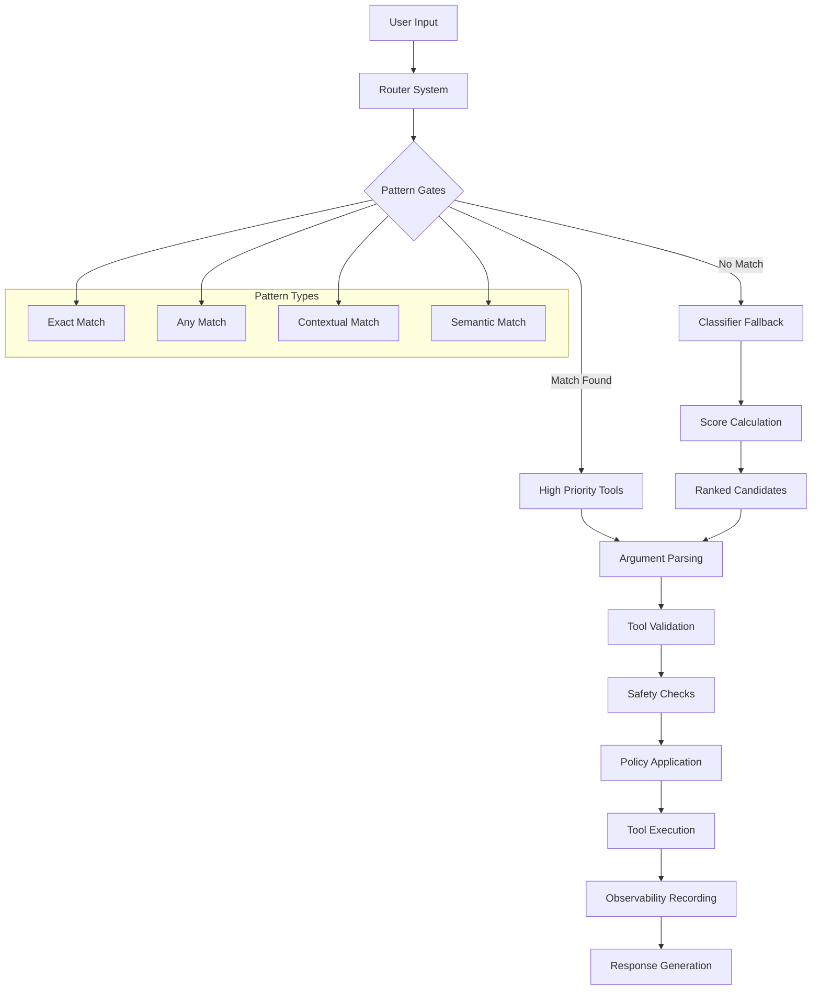
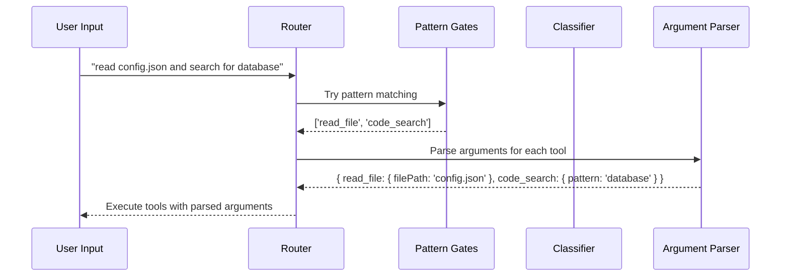
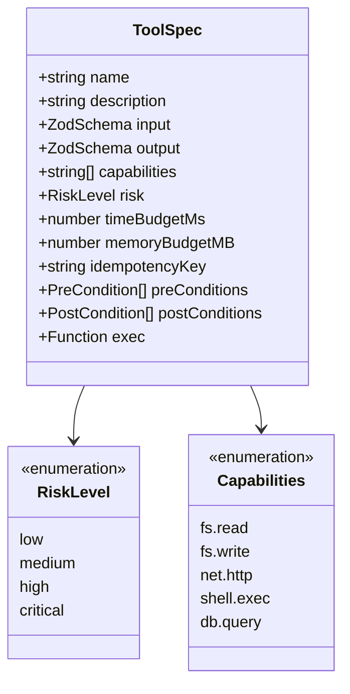
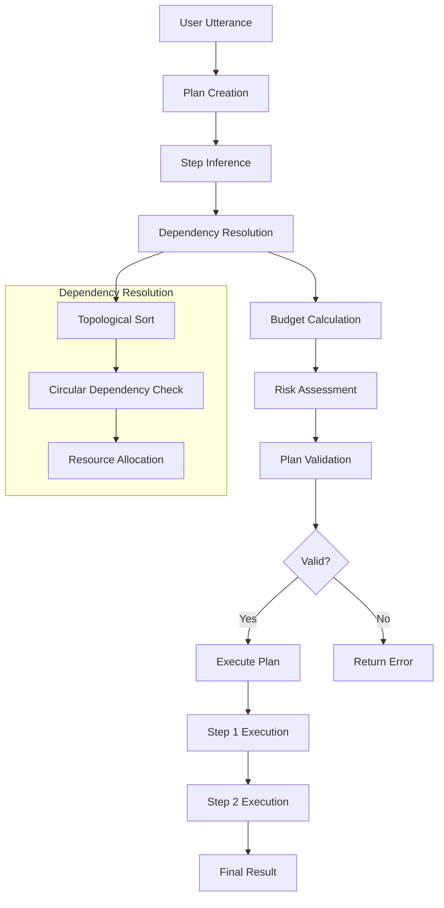
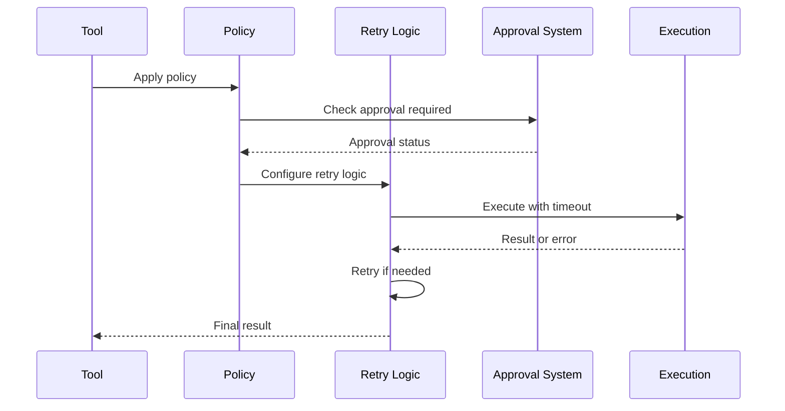
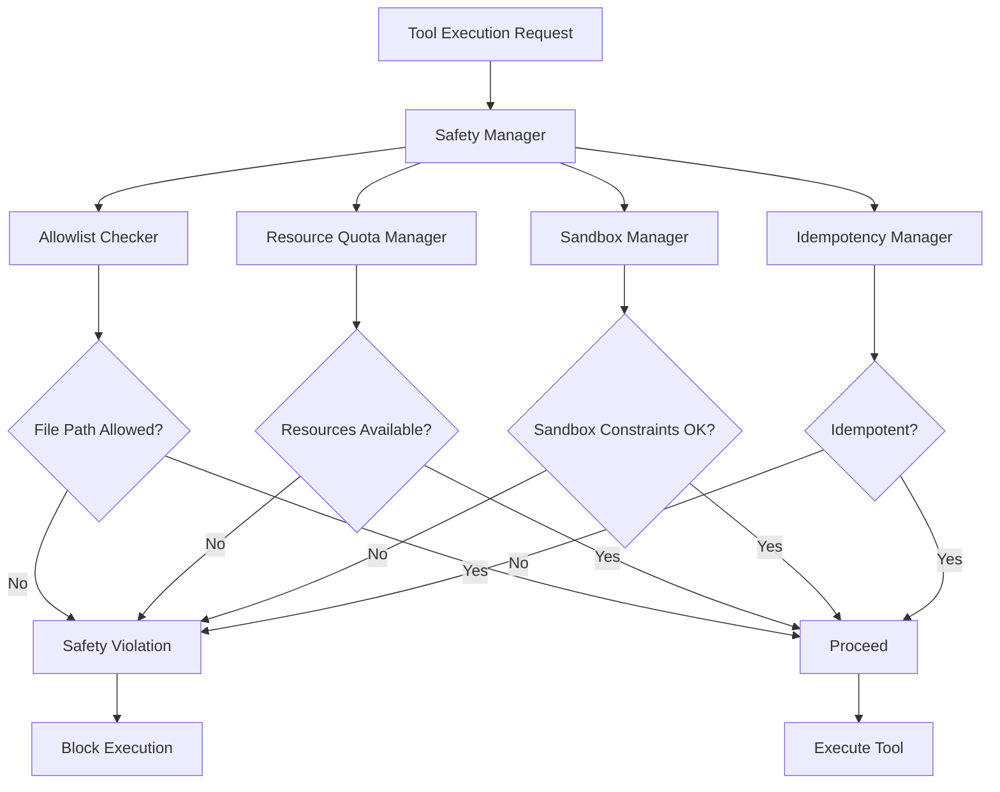
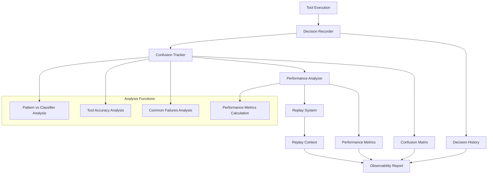
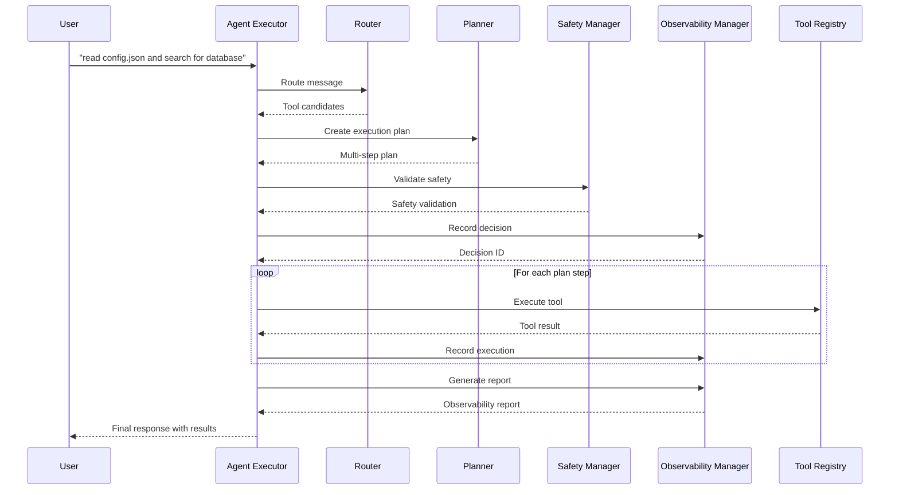

# Tool Calling and Routing

The Fx Framework provides a tool calling system with routing, argument parsing, and safety controls. This system combines pattern matching with learned classifiers for fast tool selection.

## Table of Contents

1. [Architecture Overview](#architecture-overview)
2. [Router System](#router-system)
3. [Argument Parsing DSL](#argument-parsing-dsl)
4. [Tool Specifications](#tool-specifications)
5. [Planning and Execution](#planning-and-execution)
6. [Policy Decorators](#policy-decorators)
7. [Safety Controls](#safety-controls)
8. [Observability](#observability)
9. [Agent Executor](#agent-executor)
10. [Complete Examples](#complete-examples)
11. [Best Practices](#best-practices)

## Architecture Overview

The Fx Framework uses a **hybrid approach** for tool selection that combines:

1. **Pattern Gates** - Fast, deterministic matching for explicit requests
2. **Classifier Fallback** - Flexible scoring for ambiguous or creative language
3. **Argument DSL** - Declarative parsing without fragile regex
4. **Tool Metadata** - Specifications with validation
5. **Safety Controls** - Allowlists, quotas, and sandboxing
6. **Observability** - Decision tracking and performance analysis



## Router System

The router system combines pattern matching with a learned classifier for tool selection.

### Pattern Gates

Pattern gates provide fast, deterministic tool selection based on regex patterns:

```typescript
import { patternGate } from '@fx/core';

const gated = patternGate('read the file config.json', []);
// Returns: ['read_file']
```

### Router with Classifier Fallback

When patterns don't match, the router falls back to a tiny classifier:

```typescript
import { ToolRouter } from '@fx/core';

const router = new ToolRouter();
const { candidates } = await router.route({ text: 'show me the config' }, []);
// Returns: [{ tool: 'read_file', score: 0.7, reason: 'classifier' }]
```

### Router Flow



## Argument Parsing DSL

The declarative argument DSL handles complex inputs without fragile regex:

### Basic Parsers

```typescript
import { quoted, filePath, number, boolean } from '@fx/core';

const quotedText = quoted()('"Hello World"'); // "Hello World"
const path = filePath()('/path/to/file.txt'); // "/path/to/file.txt"
const num = number()('42'); // 42
const bool = boolean()('true'); // true
```

### Combinator Parsers

```typescript
import { firstOf, sequence, optional, many } from '@fx/core';

// Try multiple parsers
const parser = firstOf(quoted(), filePath());

// Parse sequence of values
const sequenceParser = sequence(quoted(), number());

// Optional parsing
const optionalParser = optional(quoted());

// Multiple occurrences
const manyParser = many(quoted());
```

### Tool-Specific Parsers

```typescript
import { argSpec } from '@fx/core';

// File operations
const readArgs = argSpec.read_file('read "config.json"');
// { filePath: "config.json" }

const writeArgs = argSpec.write_file('write to output.txt with content "Hello"');
// { filePath: "output.txt", content: "Hello" }

// Search operations
const searchArgs = argSpec.search('search for "TypeScript" limit 10');
// { query: "TypeScript", maxResults: 10 }

// API calls
const apiArgs = argSpec.api_call('call https://api.github.com/users/octocat');
// { url: "https://api.github.com/users/octocat", method: "GET" }

// Command execution
const commandArgs = argSpec.execute_command('run ls -la in /home/user');
// { command: "ls -la", workingDirectory: "/home/user" }
```

## Tool Specifications

Tools are defined with metadata including capabilities, risk levels, and validation:

### Creating Tool Specifications

```typescript
import { ToolBuilder } from '@fx/core';
import { z } from 'zod';

const readFileTool = new ToolBuilder()
  .name('read_file')
  .description('Read contents of a file')
  .input(z.object({
    filePath: z.string().min(1)
  }))
  .output(z.object({
    content: z.string(),
    size: z.number()
  }))
  .capabilities(['fs.read'])
  .risk('low')
  .timeBudgetMs(5000)
  .memoryBudgetMB(10)
  .idempotencyKey((args: any) => `read:${args.filePath}`)
  .preConditions([
    (args: any) => args.filePath && typeof args.filePath === 'string'
  ])
  .postConditions([
    (result: any) => result && typeof result.content === 'string'
  ])
  .exec(async (args: any) => {
    // Implementation here
    return { content: 'file content', size: 100 };
  })
  .build();
```

### Tool Metadata Structure



## Planning and Execution

The planner handles multi-step operations with dependency resolution:

### Creating Plans

```typescript
import { planFromUtterance } from '@fx/core';

const plan = planFromUtterance(
  'read config.json and write to output.txt', 
  [readTool, writeTool]
);

console.log(plan.steps.length); // 2
console.log(plan.totalTimeBudgetMs); // Combined time budgets
console.log(plan.riskLevel); // 'low', 'medium', 'high', or 'critical'
```

### Plan Execution Flow



## Policy Decorators

Apply policies for timeouts, retries, and safety controls:

### Default Policies by Risk

```typescript
import { withPolicies } from '@fx/core';

const policy: Policy = {
  timeoutMs: 5000,
  retries: 2,
  backoff: 'exponential',
  approval: false
};

const safeTool = withPolicies(tool, policy);
```

### Policy Application Flow



## Safety Controls

The safety system provides allowlists, quotas, and sandboxing:

### Safety Configuration

```typescript
import { createDefaultSafetyConfig, SafetyManager } from '@fx/core';

const safetyConfig = createDefaultSafetyConfig();
const safetyManager = new SafetyManager(safetyConfig);

// Validate tool execution
const validation = safetyManager.validateExecution(tool, args);
if (!validation.valid) {
  console.error('Safety violations:', validation.violations);
}
```

### Safety Architecture



## Observability

Track decisions and performance for continuous improvement:

### Decision Recording

```typescript
import { ObservabilityManager } from '@fx/core';

const observability = new ObservabilityManager();

const recordId = observability.recordDecision({
  input: 'read config.json',
  patternsMatched: ['read_file'],
  routerCandidates: [{ tool: 'read_file', score: 0.9, reason: 'pattern' }],
  chosen: ['read_file'],
  args: { read_file: { filePath: 'config.json' } },
  outcome: 'ok',
  latMs: 150
});
```

### Observability Architecture



## Agent Executor

The agent executor provides a unified interface for all tool calling functionality:

### Basic Usage

```typescript
import { AgentExecutor } from '@fx/core';

const executor = new AgentExecutor();

const { state, result } = await executor.runTurn(initialState, 
  'read config.json and write to output.txt'
);

if (result.success) {
  console.log('Execution successful:', result.results);
} else {
  console.error('Execution failed:', result.error);
}
```

### Complete Execution Flow



## Complete Examples

### Example 1: Basic Tool Calling

```typescript
import { 
  ToolRouter, 
  patternGate, 
  argSpec,
  ToolBuilder,
  AgentExecutor,
  ObservabilityManager
} from '@fx/core';
import { z } from 'zod';

// Create tools
const readFileTool = new ToolBuilder()
  .name('read_file')
  .description('Read contents of a file')
  .input(z.object({ filePath: z.string() }))
  .output(z.object({ content: z.string(), size: z.number() }))
  .capabilities(['fs.read'])
  .risk('low')
  .exec(async (args: any) => {
    // Simulate file reading
    return { content: `Content of ${args.filePath}`, size: 1024 };
  })
  .build();

const tools = [readFileTool];

// Create router and executor
const router = new ToolRouter();
const observability = new ObservabilityManager();
const executor = new AgentExecutor();

// Execute
const result = await executor.runTurn(
  { userMessage: 'read config.json' },
  'read config.json'
);

console.log('Result:', result);
```

### Example 2: Multi-Step Planning

```typescript
import { planFromUtterance } from '@fx/core';

const plan = planFromUtterance(
  'read config.json and write to output.txt',
  tools
);

console.log('Plan steps:', plan.steps.length);
console.log('Total time budget:', plan.totalTimeBudgetMs);
console.log('Risk level:', plan.riskLevel);
```

### Example 3: With Safety and Observability

```typescript
import { 
  createDefaultSafetyConfig, 
  SafetyManager,
  ObservabilityManager 
} from '@fx/core';

const safetyConfig = createDefaultSafetyConfig();
const safetyManager = new SafetyManager(safetyConfig);
const observability = new ObservabilityManager();

// Record decision
const decisionId = observability.recordDecision({
  input: 'read config.json',
  patternsMatched: ['read_file'],
  routerCandidates: [{ tool: 'read_file', score: 0.9, reason: 'pattern' }],
  chosen: ['read_file'],
  args: { filePath: 'config.json' },
  outcome: 'ok',
  latMs: 150
});

// Get observability report
const report = observability.getReport();
console.log('Tool accuracy:', report.confusionMatrix.toolAccuracy);
console.log('Performance metrics:', report.confusionMatrix.performanceMetrics);
```

## Best Practices

### 1. Use Pattern Gates First
Use patterns for reliable tool selection:

```typescript
// Good: Specific patterns
const patterns = [
  { pattern: /\bread\s+.*\.json\b/i, tool: 'read_file', confidence: 0.9 },
  { pattern: /\bsearch\s+for\b/i, tool: 'code_search', confidence: 0.8 }
];

// Avoid: Overly broad patterns
const badPatterns = [
  { pattern: /\bread\b/i, tool: 'read_file', confidence: 0.5 }
];
```

### 2. Define Clear Tool Specifications
Include proper capabilities, risk levels, and validation:

```typescript
// Good: Complete specification
const tool = new ToolBuilder()
  .name('read_file')
  .capabilities(['fs.read'])
  .risk('low')
  .timeBudgetMs(5000)
  .preConditions([(args) => args.filePath && existsSync(args.filePath)])
  .postConditions([(result) => result && result.content])
  .build();

// Avoid: Minimal specification
const badTool = new ToolBuilder()
  .name('read_file')
  .exec(async (args) => { /* implementation */ })
  .build();
```

### 3. Apply Appropriate Policies
Use risk-based policies for safety controls:

```typescript
// Good: Risk-based policies
const getPolicyForRisk = (risk: string) => {
  switch (risk) {
    case 'low': return { timeoutMs: 5000, retries: 1 };
    case 'high': return { timeoutMs: 30000, retries: 3, approval: true };
    default: return { timeoutMs: 10000, retries: 2 };
  }
};

// Avoid: One-size-fits-all policies
const badPolicy = { timeoutMs: 5000, retries: 1 }; // Applied to all tools
```

### 4. Monitor Performance
Use observability to track and improve tool selection:

```typescript
// Good: Complete monitoring
const observability = new ObservabilityManager();

// Record all decisions
observability.recordDecision({
  input: userInput,
  patternsMatched: patternResults,
  routerCandidates: candidates,
  chosen: selectedTools,
  args: parsedArgs,
  outcome: result.success ? 'ok' : 'fail',
  latMs: executionTime
});

// Analyze performance
const report = observability.getReport();
console.log('Success rate:', report.confusionMatrix.performanceMetrics.successRate);
```

### 5. Handle Errors Gracefully
Use the error handling provided by the framework:

```typescript
// Good: Proper error handling
try {
  const result = await tool.exec(args);
  return { success: true, data: result };
} catch (error) {
  return { 
    success: false, 
    error: error.message,
    errorType: categorizeError(error.message)
  };
}

// Avoid: Silent failures
const result = await tool.exec(args); // What if this fails?
```

## Quick Reference

### Router System
```typescript
// Pattern gates
const gated = patternGate(text, patternRules);

// Router with classifier
const router = new ToolRouter();
const { candidates } = await router.route({ text }, gated);
```

### Argument Parsing
```typescript
// Basic parsers
const quoted = quoted()('"Hello World"');
const path = filePath()('/path/to/file.txt');

// Tool-specific parsing
const args = argSpec[chosenTool.name as keyof typeof argSpec]?.(message) || {};
```

### Tool Specifications
```typescript
const tool = new ToolBuilder()
  .name('tool_name')
  .input(schema)
  .output(schema)
  .capabilities(['cap1', 'cap2'])
  .risk('low')
  .exec(implementation)
  .build();
```

### Safety Controls
```typescript
const safetyConfig = createDefaultSafetyConfig();
const safetyManager = new SafetyManager(safetyConfig);
const validation = safetyManager.validateExecution(tool, args);
```

### Observability
```typescript
const observability = new ObservabilityManager();
const decisionId = observability.recordDecision(decisionData);
const report = observability.getReport();
```

## Examples Directory

See the [examples directory](../../examples/) for complete working examples:

- `tool-calling-example.ts` - Basic tool calling demonstration
- `coding-agent/` - Progressive coding agent with full integration
- `research-agent/` - Deep research agent with observability
- `advanced-agent-example.ts` - P0 features demonstration

Each example demonstrates different aspects of the tool calling system and can be run independently to understand the framework's capabilities.
