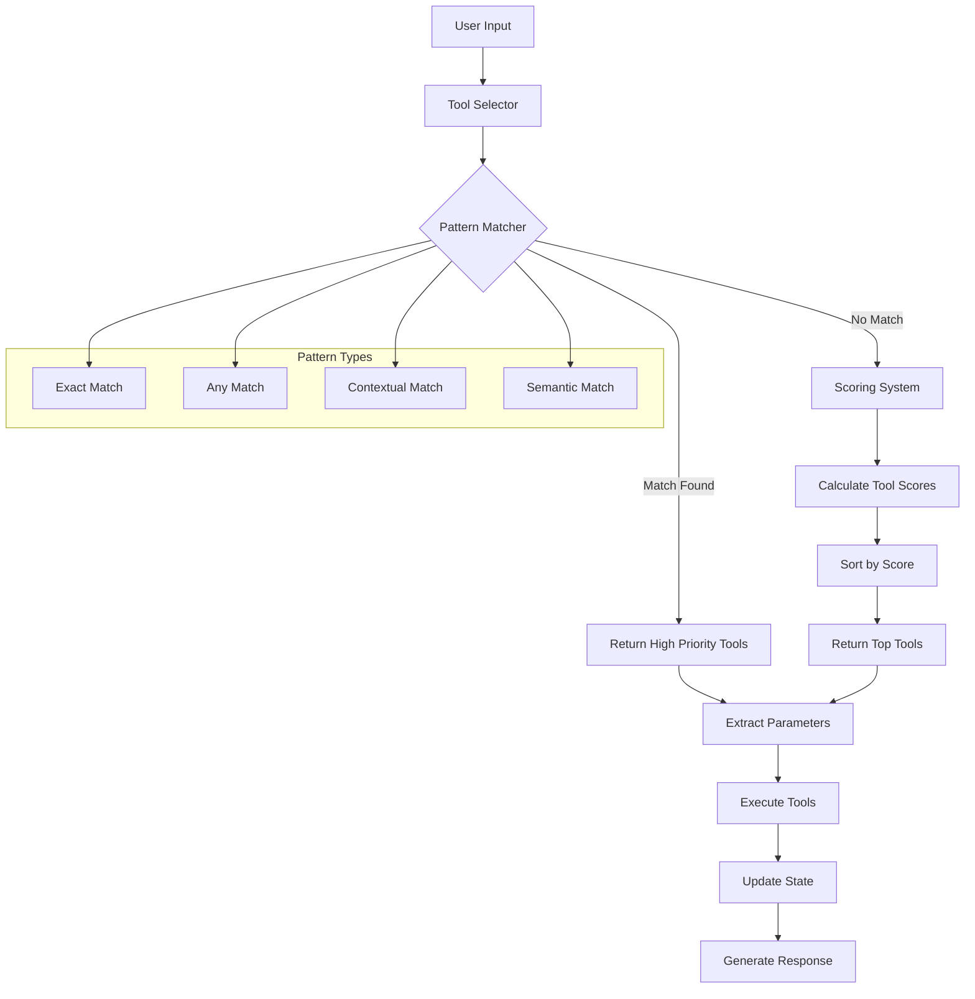
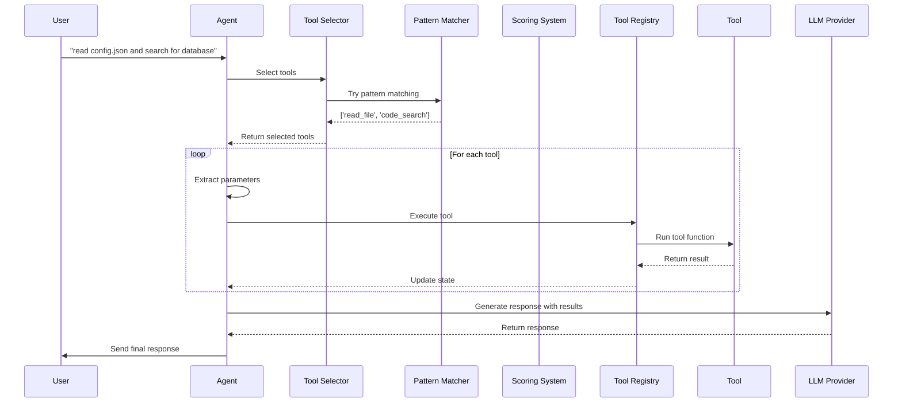

# Fx Framework Tool Calling Approach

This document explains how the Fx Framework handles tool selection and execution, providing a clear, step-by-step breakdown with real examples.

## Table of Contents

1. [Overview](#overview)
2. [Tool Selection Architecture](#tool-selection-architecture)
3. [Step-by-Step Example](#step-by-step-example)
4. [Pattern Matching System](#pattern-matching-system)
5. [Scoring System](#scoring-system)
6. [Tool Execution Flow](#tool-execution-flow)
7. [Complete Example](#complete-example)
8. [Advanced Patterns](#advanced-patterns)

## Overview

The Fx Framework uses a **hybrid approach** for tool selection that combines:

1. **Pattern Matching** - Fast, precise matching for explicit requests
2. **Scoring System** - Flexible fallback for ambiguous or creative language
3. **Parameter Extraction** - Intelligent parsing of user input
4. **Tool Execution** - Functional composition with error handling

This approach provides **speed**, **reliability**, and **flexibility** without relying on expensive LLM function calling.

## Tool Selection Architecture



## Step-by-Step Example

Let's trace through a complete example with the user prompt: **"read the config.json file and search for database settings"**

### Step 1: User Input Processing

```typescript
// User input
const userInput = "read the config.json file and search for database settings";

// State update
const state: AgentState = {
  conversation: [
    { role: 'user', content: userInput }
  ],
  currentGoal: userInput,
  toolsToUse: [],
  // ... other state
};
```

### Step 2: Tool Selection

#### 2.1 Pattern Matching (First Attempt)

```typescript
const matcher = createPatternMatcher<AgentState, string[]>();

// Register patterns
matcher.addMany([
  // Exact match for "read" + "file"
  createPattern(
    patterns.all(
      patterns.fieldContains('conversation', 'read'),
      patterns.fieldContains('conversation', 'file')
    ),
    () => ['read_file'],
    10 // High priority
  ),
  
  // Any match for search-related terms
  createPattern(
    patterns.any(
      patterns.fieldContains('conversation', 'search'),
      patterns.fieldContains('conversation', 'find'),
      patterns.fieldContains('conversation', 'look for')
    ),
    () => ['code_search'],
    8
  ),
  
  // Contextual match for file operations
  createPattern(
    patterns.contextual([
      { keywords: ['read'], required: true },
      { keywords: ['.json', '.txt', '.md'], required: false }
    ]),
    () => ['read_file'],
    9
  )
]);

// Try pattern matching
const patternResult = matcher.createMatcher(() => [])(state);
console.log('Pattern result:', patternResult); // ['read_file', 'code_search']
```

**Result**: Pattern matching found both `read_file` and `code_search` tools.

#### 2.2 Scoring System (Fallback - Not Used in This Case)

Since pattern matching found results, we skip the scoring system. But here's how it would work:

```typescript
const calculateToolScore = (state: AgentState, tool: string): number => {
  const lastMessage = state.conversation?.[state.conversation.length - 1]?.content?.toLowerCase() || '';
  let score = 0;

  switch (tool) {
    case 'read_file':
      if (lastMessage.includes('read')) score += 5;
      if (lastMessage.includes('file')) score += 3;
      if (lastMessage.includes('.json')) score += 2;
      if (lastMessage.includes('config')) score += 2;
      break;
      
    case 'code_search':
      if (lastMessage.includes('search')) score += 5;
      if (lastMessage.includes('find')) score += 3;
      if (lastMessage.includes('database')) score += 2;
      if (lastMessage.includes('settings')) score += 2;
      break;
      
    case 'list_files':
      if (lastMessage.includes('list')) score += 4;
      if (lastMessage.includes('files')) score += 3;
      break;
  }

  return score;
};

// If pattern matching failed, we'd use scoring:
// read_file: 5 + 3 + 2 + 2 = 12 points
// code_search: 5 + 2 + 2 = 9 points
// list_files: 0 points
```

### Step 3: Parameter Extraction

For each selected tool, we extract parameters from the user input:

```typescript
const extractToolParameters = (state: AgentState, toolName: string): Record<string, any> => {
  const lastMessage = state.conversation?.[state.conversation.length - 1]?.content?.toLowerCase() || '';
  
  switch (toolName) {
    case 'read_file':
      // Extract file path: "read the config.json file"
      const fileMatch = lastMessage.match(/(?:read|open|show)\s+(?:the\s+)?(?:file\s+)?([^\s]+)/);
      if (!fileMatch?.[1]) {
        throw new Error('No file path found. Please specify which file to read.');
      }
      return { filePath: fileMatch[1] }; // { filePath: "config.json" }
      
    case 'code_search':
      // Extract search pattern: "search for database settings"
      const searchMatch = lastMessage.match(/(?:search|find|look for)\s+(?:for\s+)?([^.!?]+)/);
      if (!searchMatch?.[1]) {
        throw new Error('No search pattern found. Please specify what to search for.');
      }
      return { 
        pattern: searchMatch[1].trim(), // { pattern: "database settings" }
        directoryPath: '.' // Default to current directory
      };
      
    default:
      return {};
  }
};

// Extract parameters for both tools
const readFileParams = extractToolParameters(state, 'read_file');
// Result: { filePath: "config.json" }

const searchParams = extractToolParameters(state, 'code_search');
// Result: { pattern: "database settings", directoryPath: "." }
```

### Step 4: Tool Execution

Execute the selected tools in sequence:

```typescript
const executeTools = async (state: AgentState) => {
  const toolsToUse = ['read_file', 'code_search'];
  const toolRegistry = createToolRegistry();
  
  let currentState = state;
  
  for (const toolName of toolsToUse) {
    try {
      console.log(`⚡ Executing tool: ${toolName}`);
      
      // Get parameters for this tool
      const parameters = extractToolParameters(currentState, toolName);
      
      // Execute tool
      currentState = await toolRegistry.execute(toolName, {
        ...currentState,
        toolInput: parameters
      });
      
      console.log(`✅ Tool ${toolName} completed`);
    } catch (error) {
      console.error(`❌ Tool ${toolName} failed:`, (error as Error).message);
      currentState = updateState({
        lastError: (error as Error).message
      })(currentState);
    }
  }
  
  return currentState;
};
```

## Pattern Matching System

### Pattern Types Explained

#### 1. Exact Match (`patterns.all`)
Requires ALL conditions to be true:

```typescript
createPattern(
  patterns.all(
    patterns.fieldContains('conversation', 'read'),
    patterns.fieldContains('conversation', 'file')
  ),
  () => ['read_file'],
  10
)

// Matches: "read the file", "read file", "please read the file"
// Doesn't match: "read", "file", "show the file"
```

#### 2. Any Match (`patterns.any`)
Requires ANY condition to be true:

```typescript
createPattern(
  patterns.any(
    patterns.fieldContains('conversation', 'search'),
    patterns.fieldContains('conversation', 'find'),
    patterns.fieldContains('conversation', 'look for')
  ),
  () => ['code_search'],
  8
)

// Matches: "search for", "find something", "look for items"
// Doesn't match: "read", "write", "delete"
```

#### 3. Contextual Match (`patterns.contextual`)
More sophisticated matching with required/optional keywords:

```typescript
createPattern(
  patterns.contextual([
    { keywords: ['read'], required: true },
    { keywords: ['.json', '.txt', '.md'], required: false }
  ]),
  () => ['read_file'],
  9
)

// Matches: "read config.json", "read the file", "read data.txt"
// Doesn't match: "write file", "delete config.json"
```

#### 4. Semantic Match (`patterns.semantic`)
Matches based on semantic meaning:

```typescript
createPattern(
  patterns.semantic('file_operations', ['read_file']),
  () => ['read_file'],
  7
)

// Matches based on semantic understanding of file operations
```

### Custom Pattern Functions

```typescript
const createToolMatcher = {
  exact: (keywords: string[], tools: string[], priority: number = 10) => 
    createPattern(
      patterns.all(...keywords.map(keyword => 
        patterns.fieldContains('conversation', keyword)
      )),
      () => tools,
      priority
    ),
  
  any: (keywords: string[], tools: string[], priority: number = 8) =>
    createPattern(
      patterns.any(...keywords.map(keyword => 
        patterns.fieldContains('conversation', keyword)
      )),
      () => tools,
      priority
    ),
  
  contextual: (contexts: Array<{keywords: string[], required: boolean}>, tools: string[], priority: number = 9) =>
    createPattern(
      patterns.contextual(contexts),
      () => tools,
      priority
    )
};

// Usage
matcher.addMany([
  createToolMatcher.exact(['read', 'file'], ['read_file'], 10),
  createToolMatcher.any(['search', 'find'], ['code_search'], 8),
  createToolMatcher.contextual([
    { keywords: ['write'], required: true },
    { keywords: ['.txt', '.json'], required: false }
  ], ['write_file'], 9)
]);
```

## Scoring System

### How Scoring Works

```typescript
const calculateToolScore = (state: AgentState, tool: string): number => {
  const lastMessage = state.conversation?.[state.conversation.length - 1]?.content?.toLowerCase() || '';
  let score = 0;

  switch (tool) {
    case 'read_file':
      // Primary keywords (high weight)
      if (lastMessage.includes('read')) score += 5;
      if (lastMessage.includes('open')) score += 4;
      if (lastMessage.includes('show')) score += 3;
      
      // Secondary keywords (medium weight)
      if (lastMessage.includes('file')) score += 3;
      if (lastMessage.includes('content')) score += 2;
      
      // File extensions (low weight)
      if (lastMessage.includes('.json')) score += 2;
      if (lastMessage.includes('.txt')) score += 2;
      if (lastMessage.includes('.md')) score += 2;
      
      // Context keywords
      if (lastMessage.includes('config')) score += 1;
      if (lastMessage.includes('settings')) score += 1;
      break;
      
    case 'code_search':
      // Primary keywords
      if (lastMessage.includes('search')) score += 5;
      if (lastMessage.includes('find')) score += 4;
      if (lastMessage.includes('look for')) score += 3;
      
      // Secondary keywords
      if (lastMessage.includes('code')) score += 3;
      if (lastMessage.includes('function')) score += 2;
      if (lastMessage.includes('class')) score += 2;
      
      // Context keywords
      if (lastMessage.includes('database')) score += 2;
      if (lastMessage.includes('api')) score += 2;
      if (lastMessage.includes('settings')) score += 1;
      break;
      
    case 'write_file':
      // Primary keywords
      if (lastMessage.includes('write')) score += 5;
      if (lastMessage.includes('create')) score += 4;
      if (lastMessage.includes('save')) score += 3;
      
      // Secondary keywords
      if (lastMessage.includes('file')) score += 3;
      if (lastMessage.includes('content')) score += 2;
      break;
  }

  return score;
};
```

### Scoring Examples

```typescript
// Example 1: "read the config.json file"
// read_file: 5 (read) + 3 (file) + 2 (.json) + 1 (config) = 11 points
// code_search: 0 points
// write_file: 0 points
// Result: ['read_file']

// Example 2: "search for database settings"
// read_file: 0 points
// code_search: 5 (search) + 2 (database) + 1 (settings) = 8 points
// write_file: 0 points
// Result: ['code_search']

// Example 3: "find and read the API config"
// read_file: 4 (read) + 3 (file) + 1 (config) = 8 points
// code_search: 4 (find) + 2 (api) + 1 (config) = 7 points
// write_file: 0 points
// Result: ['read_file', 'code_search']
```

## Tool Execution Flow



## Complete Example

Here's a complete working example:

```typescript
import { 
  step, sequence, createPlan, createAgent,
  createValidatedTool, createToolStep, Either,
  createPatternMatcher, createPattern, patterns,
  updateState, get
} from '@fx/core';
import { z } from 'zod';
import { readFileSync, existsSync } from 'fs';
import { resolve } from 'path';

// State interface
interface AgentState {
  conversation: Array<{ role: string; content: string }>;
  currentGoal: string;
  toolsToUse: string[];
  lastToolResult?: unknown;
  memory: Array<{ type: string; content: string; timestamp: string }>;
}

// Tool schemas
const ReadFileSchema = z.object({
  filePath: z.string()
});

const CodeSearchSchema = z.object({
  pattern: z.string(),
  directoryPath: z.string().optional()
});

// Tool implementations
const createToolRegistry = () => {
  return createFxToolRegistry([
    createValidatedTool('read_file', 'Read contents of a file', ReadFileSchema,
      async (input: { filePath: string }, state: AgentState) => {
        const toolStep = createToolStep(
          'read_file',
          async () => {
            try {
              const resolvedPath = resolve(input.filePath);
              if (!existsSync(resolvedPath)) {
                throw new Error(`File not found: ${input.filePath}`);
              }
              const content = readFileSync(resolvedPath, 'utf-8');
              return Either.right(content);
            } catch (error) {
              return Either.left(error as Error);
            }
          },
          (result) => ({
            filePath: input.filePath,
            content: result,
            wordCount: result.split(' ').length
          })
        );
        return await toolStep(state) as AgentState;
      }
    ),

    createValidatedTool('code_search', 'Search for patterns in code', CodeSearchSchema,
      async (input: { pattern: string; directoryPath?: string }, state: AgentState) => {
        const toolStep = createToolStep(
          'code_search',
          async () => {
            try {
              // Simulate code search
              const mockResults = [
                `Found "${input.pattern}" in config.json line 15`,
                `Found "${input.pattern}" in database.js line 42`
              ];
              return Either.right(mockResults);
            } catch (error) {
              return Either.left(error as Error);
            }
          },
          (result) => ({
            pattern: input.pattern,
            results: result,
            resultCount: result.length
          })
        );
        return await toolStep(state) as AgentState;
      }
    )
  ]);
};

// Tool selector
const createToolSelector = () => {
  const matcher = createPatternMatcher<AgentState, string[]>();
  
  matcher.addMany([
    createPattern(
      patterns.all(
        patterns.fieldContains('conversation', 'read'),
        patterns.fieldContains('conversation', 'file')
      ),
      () => ['read_file'],
      10
    ),
    
    createPattern(
      patterns.any(
        patterns.fieldContains('conversation', 'search'),
        patterns.fieldContains('conversation', 'find')
      ),
      () => ['code_search'],
      8
    )
  ]);
  
  return (state: AgentState): string[] => {
    const patternResult = matcher.createMatcher(() => [])(state);
    if (patternResult.length > 0) {
      return patternResult;
    }
    
    // Fallback scoring
    const lastMessage = state.conversation?.[state.conversation.length - 1]?.content?.toLowerCase() || '';
    const scores = [
      { tool: 'read_file', score: lastMessage.includes('read') ? 5 : 0 },
      { tool: 'code_search', score: lastMessage.includes('search') ? 5 : 0 }
    ];
    
    return scores
      .filter(({ score }) => score > 0)
      .sort((a, b) => b.score - a.score)
      .map(({ tool }) => tool);
  };
};

// Parameter extraction
const extractToolParameters = (state: AgentState, toolName: string): Record<string, any> => {
  const lastMessage = state.conversation?.[state.conversation.length - 1]?.content?.toLowerCase() || '';
  
  switch (toolName) {
    case 'read_file':
      const fileMatch = lastMessage.match(/(?:read|open|show)\s+(?:the\s+)?(?:file\s+)?([^\s]+)/);
      if (!fileMatch?.[1]) {
        throw new Error('No file path found. Please specify which file to read.');
      }
      return { filePath: fileMatch[1] };
      
    case 'code_search':
      const searchMatch = lastMessage.match(/(?:search|find|look for)\s+(?:for\s+)?([^.!?]+)/);
      if (!searchMatch?.[1]) {
        throw new Error('No search pattern found. Please specify what to search for.');
      }
      return { 
        pattern: searchMatch[1].trim(),
        directoryPath: '.'
      };
      
    default:
      return {};
  }
};

// Workflow
const workflow = sequence([
  step('selectTools', (state: AgentState) => {
    const toolSelector = createToolSelector();
    const toolsToUse = toolSelector(state);
    console.log(`🔧 Selected tools: ${toolsToUse.join(', ')}`);
    return updateState({ toolsToUse })(state);
  }),
  
  step('executeTools', async (state: AgentState) => {
    const toolRegistry = createToolRegistry();
    const toolsToUse = state.toolsToUse || [];
    
    let currentState = state;
    for (const toolName of toolsToUse) {
      try {
        console.log(`⚡ Executing tool: ${toolName}`);
        const parameters = extractToolParameters(currentState, toolName);
        currentState = await toolRegistry.execute(toolName, {
          ...currentState,
          toolInput: parameters
        });
        console.log(`✅ Tool ${toolName} completed`);
      } catch (error) {
        console.error(`❌ Tool ${toolName} failed:`, (error as Error).message);
      }
    }
    
    return currentState;
  })
]);

// Agent
const plan = createPlan('tool-agent', [workflow]);
const agent = createAgent('tool-agent', plan);

// Test the agent
const testAgent = async () => {
  const initialState: AgentState = {
    conversation: [
      { role: 'user', content: 'read the config.json file and search for database settings' }
    ],
    currentGoal: 'read the config.json file and search for database settings',
    toolsToUse: [],
    memory: []
  };
  
  const result = await agent.start(initialState);
  console.log('Final result:', result);
};

testAgent();
```

## Advanced Patterns

### 1. Multi-Tool Execution

```typescript
// Handle complex requests that need multiple tools
const handleComplexRequest = (state: AgentState) => {
  const lastMessage = state.conversation?.[state.conversation.length - 1]?.content?.toLowerCase() || '';
  
  // Check for multiple operations
  if (lastMessage.includes('and') || lastMessage.includes('then')) {
    const operations = lastMessage.split(/\s+(?:and|then)\s+/);
    const tools = operations.map(op => selectToolsForOperation(op));
    return tools.flat();
  }
  
  return selectToolsForOperation(lastMessage);
};
```

### 2. Context-Aware Tool Selection

```typescript
// Use conversation history for better tool selection
const createContextAwareSelector = () => {
  return (state: AgentState): string[] => {
    const recentMessages = state.conversation.slice(-3);
    const context = recentMessages.map(msg => msg.content).join(' ');
    
    // Adjust tool selection based on context
    if (context.includes('error') || context.includes('failed')) {
      return ['debug_tool', 'log_reader'];
    }
    
    if (context.includes('deploy') || context.includes('build')) {
      return ['build_tool', 'deploy_tool'];
    }
    
    return defaultToolSelector(state);
  };
};
```

### 3. Dynamic Tool Registration

```typescript
// Register tools dynamically based on available resources
const createDynamicToolRegistry = async () => {
  const availableTools = [];
  
  // Check if database is available
  if (await isDatabaseAvailable()) {
    availableTools.push(createDatabaseTool());
  }
  
  // Check if file system is accessible
  if (await isFileSystemAccessible()) {
    availableTools.push(createFileSystemTool());
  }
  
  // Check if API is reachable
  if (await isApiReachable()) {
    availableTools.push(createApiTool());
  }
  
  return createFxToolRegistry(availableTools);
};
```

## Summary

The Fx Framework's tool calling approach provides:

1. **Fast Pattern Matching** - Immediate tool selection for explicit requests
2. **Flexible Scoring** - Intelligent fallback for ambiguous language
3. **Parameter Extraction** - Smart parsing of user input
4. **Error Handling** - Graceful failure with meaningful messages
5. **Functional Composition** - Clean, composable tool execution
6. **Type Safety** - Runtime validation with Zod schemas

This approach gives us the **speed** and **reliability** of deterministic systems while maintaining the **flexibility** to handle natural language and edge cases.

## Quick Reference

### Tool Selection Flow
```typescript
// 1. Pattern Matching (fast, precise)
const patternResult = matcher.createMatcher(() => [])(state);
if (patternResult.length > 0) {
  return patternResult;
}

// 2. Scoring System (flexible fallback)
const scoredTools = allTools
  .map(tool => ({ tool, score: calculateToolScore(state, tool) }))
  .filter(({ score }) => score > 0)
  .sort((a, b) => b.score - a.score)
  .slice(0, 2)
  .map(({ tool }) => tool);

return scoredTools.length > 0 ? scoredTools : ['default_tool'];
```

### Pattern Types
```typescript
// Exact match (all conditions must be true)
patterns.all(
  patterns.fieldContains('conversation', 'read'),
  patterns.fieldContains('conversation', 'file')
)

// Any match (any condition can be true)
patterns.any(
  patterns.fieldContains('conversation', 'search'),
  patterns.fieldContains('conversation', 'find')
)

// Contextual match (required/optional keywords)
patterns.contextual([
  { keywords: ['read'], required: true },
  { keywords: ['.json', '.txt'], required: false }
])
```

### Parameter Extraction
```typescript
// Extract file path
const fileMatch = lastMessage.match(/(?:read|open|show)\s+(?:the\s+)?(?:file\s+)?([^\s]+)/);
return { filePath: fileMatch?.[1] || 'default.txt' };

// Extract search pattern
const searchMatch = lastMessage.match(/(?:search|find|look for)\s+(?:for\s+)?([^.!?]+)/);
return { pattern: searchMatch?.[1]?.trim() || 'default search' };
```

### Tool Execution
```typescript
// Execute tools in sequence
for (const toolName of toolsToUse) {
  const parameters = extractToolParameters(state, toolName);
  state = await toolRegistry.execute(toolName, {
    ...state,
    toolInput: parameters
  });
}
```

### Common Patterns

#### File Operations
```typescript
// Pattern: "read the config.json file"
// Tools: ['read_file']
// Parameters: { filePath: 'config.json' }

// Pattern: "write to settings.txt"
// Tools: ['write_file']
// Parameters: { filePath: 'settings.txt', content: '...' }
```

#### Search Operations
```typescript
// Pattern: "search for database settings"
// Tools: ['code_search']
// Parameters: { pattern: 'database settings', directoryPath: '.' }

// Pattern: "find all API endpoints"
// Tools: ['code_search']
// Parameters: { pattern: 'API endpoints', directoryPath: '.' }
```

#### System Operations
```typescript
// Pattern: "run npm install"
// Tools: ['bash_command']
// Parameters: { command: 'npm install', workingDirectory: '.' }

// Pattern: "list files in src"
// Tools: ['list_files']
// Parameters: { directoryPath: 'src' }
```

### Debugging Tips

1. **Log tool selection**:
   ```typescript
   console.log('Selected tools:', toolsToUse);
   console.log('Pattern result:', patternResult);
   console.log('Scoring result:', scoredTools);
   ```

2. **Test pattern matching**:
   ```typescript
   const testInput = "read the config file";
   const testState = { conversation: [{ role: 'user', content: testInput }] };
   const result = toolSelector(testState);
   console.log('Test result:', result);
   ```

3. **Validate parameters**:
   ```typescript
   try {
     const params = extractToolParameters(state, toolName);
     console.log('Extracted parameters:', params);
   } catch (error) {
     console.error('Parameter extraction failed:', error.message);
   }
   ```

4. **Monitor tool execution**:
   ```typescript
   console.log(`⚡ Executing tool: ${toolName}`);
   console.log(`📥 Input:`, parameters);
   console.log(`📤 Output:`, result);
   ```
