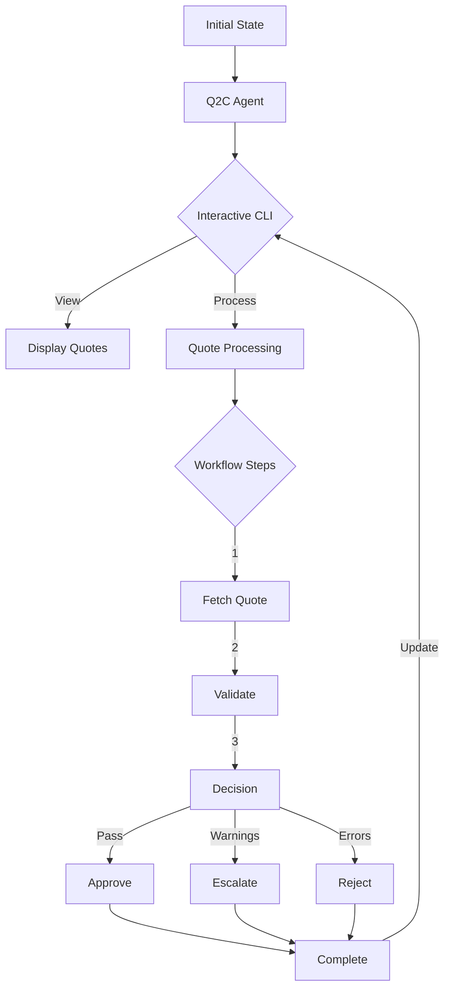

# Quote-to-Cash (Q2C) Agent

A functional, category theory-based agent for automating the Quote-to-Cash process using the f(x) framework.

## Architecture Overview



## Core Components

### 1. Interactive CLI (`run.ts`)
- User-friendly command-line interface
- Multiple processing options:
  - View all quotes with status
  - Process specific quote
  - Process quotes by status
  - Process all quotes sequentially
- Color-coded status display
- Progress tracking and results summary

```typescript
// Interactive menu example
const showMainMenu = async (quotes: Quote[]): Promise<string> => {
  const { action } = await inquirer.prompt([
    {
      type: 'list',
      name: 'action',
      message: 'Choose an action:',
      choices: [
        { name: '🔍 View all quotes', value: 'VIEW_ALL' },
        { name: '📝 Process specific quote', value: 'PROCESS_ONE' },
        { name: '📊 Process quotes by status', value: 'PROCESS_BY_STATUS' },
        { name: '🔄 Process all quotes sequentially', value: 'PROCESS_ALL' },
        { name: '❌ Exit', value: 'EXIT' }
      ]
    }
  ]);
  return action;
};
```

### 2. Deterministic Workflow (`q2cAgent.ts`)
- Clear, predictable processing steps
- Functional state transitions
- Enhanced error handling and recovery
- Progress tracking and reporting

```typescript
// Workflow steps
const processQuote = async (quote: Quote) => {
  // 1. Fetch quote details
  const quoteDetails = await fetchQuote(quote.id);
  
  // 2. Validate quote
  const validationResults = validateQuote(standardRules)(quoteDetails);
  
  // 3. Make decision based on validation
  if (hasErrors(validationResults)) {
    return rejectQuote(quote.id);
  } else if (hasWarnings(validationResults)) {
    return escalateQuote(quote.id);
  } else {
    return approveQuote(quote.id);
  }
};
```

### 3. Enhanced State Management
- Immutable state updates
- Comprehensive error tracking
- Action status monitoring
- Validation result management

```typescript
interface ExtendedQ2CAgentState extends Q2CAgentState {
  lastThought?: {
    observation: string;
    reasoning: string;
    action: {
      type: AgentActionType;
      quoteId: string;
      reason: string;
    };
  };
}
```

## Usage

1. **Environment Setup**
```bash
# Create .env file
SF_CLIENT_ID=your_client_id
SF_USERNAME=your_username
SF_LOGIN_URL=https://login.salesforce.com
SF_PRIVATE_KEY_PATH=path/to/server.key
OPENAI_API_KEY=your_openai_key  # Optional, for enhanced reasoning
```

2. **Install Dependencies**
```bash
npm install
npm install --save-dev @types/inquirer
```

3. **Run the Agent**
```bash
npx ts-node src/q2c/run.ts
```

4. **Interactive Usage**
- Choose from available actions in the menu
- View quote details with color-coded status
- Process quotes individually or in batch
- Monitor progress and results in real-time

## Implementation Details

### 1. Quote Processing Workflow
```typescript
// Sequential processing steps
const processSingleQuote = async (quote: Quote, token: OAuthToken) => {
  // Initialize state
  const initialState = createInitialState();
  
  // Add initial action
  const state = {
    ...initialState,
    pendingActions: [createAction(quote.id, AgentActionType.FetchQuote)],
    metadata: { token }
  };
  
  // Process quote through workflow
  return await q2cAgent(state, []);
};
```

### 2. Status Display
```typescript
const displayQuotes = (quotes: Quote[]) => {
  quotes.forEach(q => {
    const statusColor = {
      'Draft': chalk.blue,
      'Pending': chalk.yellow,
      'Approved': chalk.green,
      'Rejected': chalk.red
    }[q.status];
    
    console.log(`${statusColor(q.status)} ${q.name} (${q.id})`);
  });
};
```

### 3. Error Handling
```typescript
try {
  const result = await processSingleQuote(quote, token);
  displayResults(result);
} catch (error) {
  console.error(`Processing failed: ${error.message}`);
  // Update quote status and log error
}
```

## Future Enhancements

1. Add batch processing options
2. Implement quote comparison view
3. Add custom validation rule creation
4. Enhanced reporting and analytics
5. Integration with more Salesforce objects
6. Automated testing and validation

## Contributing

1. Fork the repository
2. Create a feature branch
3. Submit a pull request

## License

MIT License 